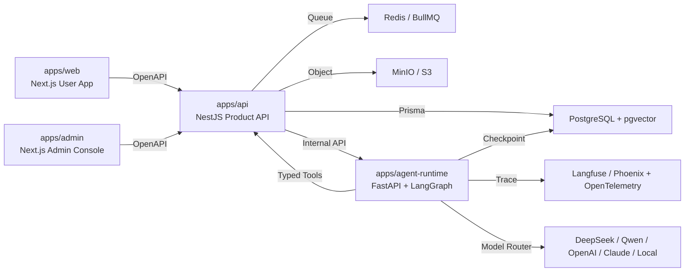
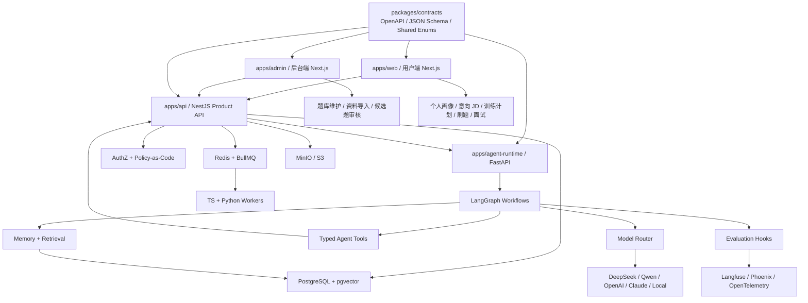
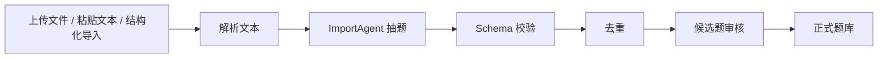
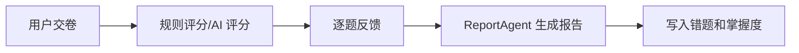
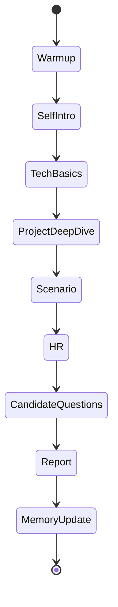
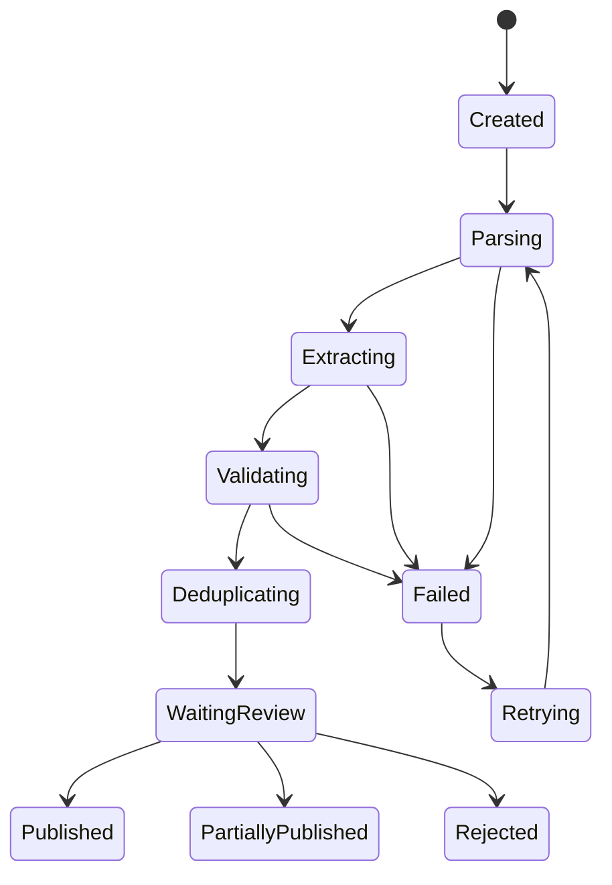
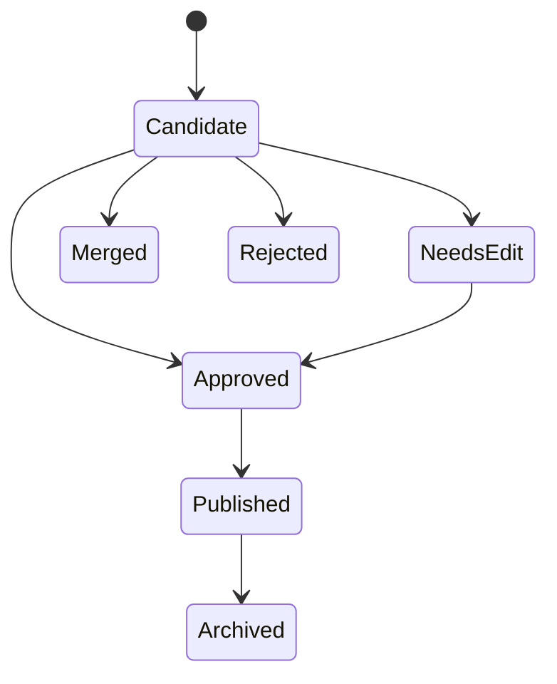
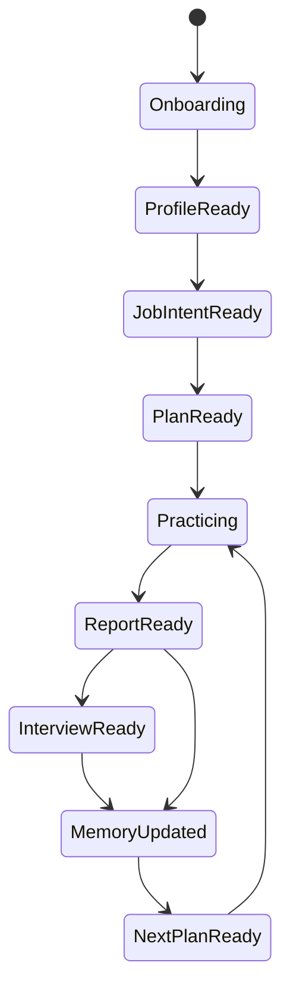
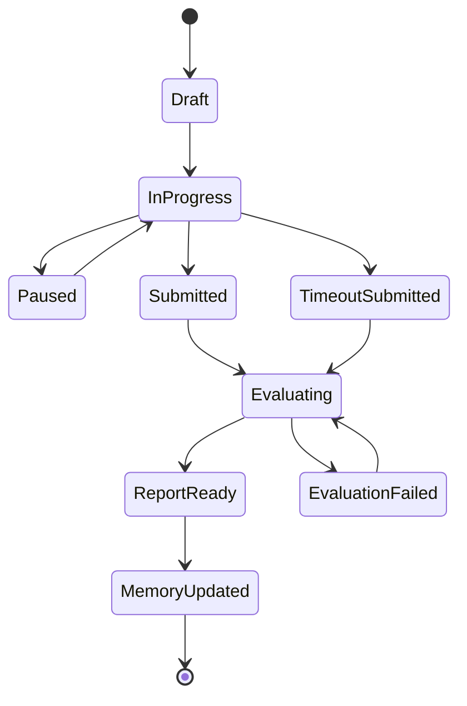
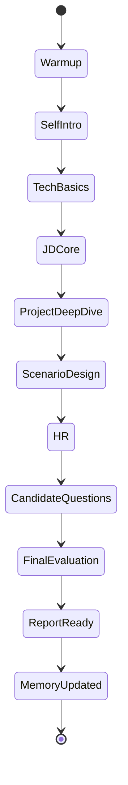

# 面试 Agent 技术方案

## 技术结论

推荐使用 `TypeScript Product Shell + Python Agent Runtime + Schema-first Contract` 的混合架构。

这不是传统 CRUD 产品，也不是简单 LangChain demo。它应该体现三层技术含量：

```text
产品层：可运营、可审核、可展示、可配置
Agent 层：可编排、可追问、可评分、可记忆
评估层：可校验、可观测、可回放、可持续改进
```

| 问题 | 结论 |
|---|---|
| 用 Python 好么？ | 好。LangGraph 状态机、RAG、评估、报告生成、模型实验、长期记忆更适合 Python。 |
| 还需要 JS/TS 吗？ | 需要。Web、后台、题库管理、权限、报告展示、配置中心继续用 TS 更稳。 |
| 能不能全 Python？ | 可以做 Agent demo，但做不出足够好的产品壳、管理后台和前端体验。 |
| 能不能全 TS？ | 可以做产品快，但复杂 Agent 状态机、评估、RAG 实验和 Python AI 生态不如 Python 顺。 |
| 是否前后端分离？ | 是，但不是传统“页面 + CRUD API”的浅分离，而是 `Web/Admin -> Product API -> Agent Runtime` 的三段式分离。 |
| 是否需要 BFF？ | 第一阶段不单独做 BFF 服务；Next.js 只作为 UI Shell，所有业务事实写入 NestJS Product API。必要的 Server Actions 只做页面编排和轻量转发。 |
| 推荐主线 | Next.js/NestJS/Prisma 做 Product Shell，Python/FastAPI/LangGraph/Pydantic 做 Agent Runtime，OpenAPI/JSON Schema 做跨语言契约。 |
| 技术含量方向 | LangGraph、结构化输出、pgvector/hybrid search、rerank、model router、prompt registry、LLM judge、OpenTelemetry、Langfuse/Phoenix 观测。 |

## 前后端分离与技术架构决策

本项目采用“强分离、弱耦合、契约优先”的架构。分离的目的不是制造更多服务，而是让产品体验、业务事实、Agent 推理和评估观测各自稳定。

```text
User Web / Admin Web
  -> NestJS Product API
  -> FastAPI Agent Runtime
  -> Model Provider / Retrieval / Evaluation
```

### 分离决策

| 决策点 | 结论 | 原因 |
|---|---|---|
| 用户端和后台端是否分离 | 代码分应用，能力分域；底层共享 UI token、contracts 和 auth client。 | 用户端重体验和训练闭环，后台端重资产治理和配置审核，页面模型不同。 |
| 前端和后端是否分离 | 分离。前端不直接连数据库、不直接调模型、不直接写 Agent 状态。 | 防止权限、审计、状态机散落到页面。 |
| Product API 和 Agent Runtime 是否分离 | 分离。NestJS 管业务事实，FastAPI/LangGraph 管 Agent 状态机。 | TS 更适合产品工程，Python 更适合 Agent/RAG/评估生态。 |
| 是否单独做 BFF | 第一阶段不做独立 BFF 服务。Next.js Server Actions 只做 UI 编排，不承载业务事实。 | 避免多一层重复鉴权和重复 DTO；后期如多端复杂再抽 BFF。 |
| 是否微服务化 | 第一阶段不做微服务。采用 monorepo 多应用 + 模块化单体 Product API。 | 当前核心风险是闭环质量，不是服务拆分规模。 |
| 是否 Docker 一体化 | 基础设施一体化，应用服务可逐步纳入 profile。 | 本地开发可控，线上部署仍保留服务边界。 |

### 运行时拓扑



### 调用链路裁决

| 链路 | 是否允许 | 说明 |
|---|---|---|
| `web/admin -> api` | 允许 | 所有页面读写都进 Product API。 |
| `web/admin -> agent-runtime` | 禁止 | 避免页面绕过权限、审计和状态机。 |
| `web/admin -> database` | 禁止 | 页面不是事实源。 |
| `api -> database` | 允许 | Product API 是业务事实源。 |
| `api -> agent-runtime` | 允许 | 通过内部 token 和 workflow grant 触发 Agent。 |
| `agent-runtime -> api` | 允许但受控 | 只能通过 typed tools 读写授权资源。 |
| `agent-runtime -> core database tables` | 默认禁止 | 除 checkpoint、trace 等运行态表外，核心业务写入走 Product API。 |
| `worker -> api/repository` | 允许 | 长任务按授权上下文执行。 |

### 前端技术方案

| 维度 | 选择 | 说明 |
|---|---|---|
| 框架 | Next.js App Router + React Server Components | 页面级数据读取、路由、布局、SEO 和首屏体验稳定。 |
| React 形态 | Server Components 优先，Client Components 局部使用 | 刷题交互、面试输入、流式输出、表单控件才进入客户端组件。 |
| UI | Tailwind CSS v4 + shadcn/ui + Radix primitives | 兼顾现代审美、可访问性、可控组件源码和快速产出。 |
| 状态管理 | URL state + Server state + 局部 client state | 不引入全局状态库承载业务事实；服务端事实来自 Product API。 |
| 请求层 | OpenAPI 生成 typed client + fetch wrapper | 避免前端手写 DTO，统一处理 auth、traceId、错误模型。 |
| 表单 | React Hook Form + Zod / contract schema | 用户画像、JD、题库编辑和模型配置都需要强校验。 |
| 数据展示 | TanStack Table / Virtualizer | 后台题库、候选题、审计日志等复杂表格。 |
| 实时反馈 | SSE 优先 | 导入进度、报告生成、面试流式输出先用 SSE；WebSocket 后置。 |
| 富文本/Markdown | MDX/Markdown renderer + sanitizer | 报告展示、题解展示、资料预览必须防注入。 |

前端边界：不保存业务事实、不拼接 prompt、不做权限最终裁决、不直接访问模型、不在浏览器保存敏感模型密钥。

### 后端 Product API 技术方案

| 维度 | 选择 | 说明 |
|---|---|---|
| 框架 | NestJS 模块化单体 | 模块边界清晰，适合权限、审计、事务、后台管理和业务状态机。 |
| ORM | Prisma + PostgreSQL | schema 明确、migration 可追踪、类型生成稳定。 |
| 数据库能力 | PostgreSQL + pgvector + full-text search | 同时承载业务事实、权限、向量检索和全文检索。 |
| API 契约 | OpenAPI + JSON Schema | 前端 typed client、Agent Pydantic schema 和测试样例都从契约出发。 |
| 权限 | `packages/authz` policy-as-code | RBAC、资源所有权、数据作用域、workflow grant 集中裁决。 |
| 任务队列 | BullMQ + Redis | 导入、向量化、评分、报告、记忆写回等异步任务。 |
| 事务一致性 | outbox pattern + domain events | 避免数据库提交成功但队列消息丢失。 |
| 文件 | MinIO/S3-compatible | 上传、解析、报告附件统一对象存储。 |
| 观测 | OpenTelemetry + structured logs | API、worker、Agent、模型调用通过 traceId 串联。 |

Product API 边界：它是业务事实源，但不写复杂 prompt、不承载多轮 Agent 推理、不直接把模型散文本写入核心表。

### Agent Runtime 技术方案

| 维度 | 选择 | 说明 |
|---|---|---|
| 框架 | FastAPI + Pydantic v2 | 内部 Agent API、schema 校验、流式事件输出。 |
| 编排 | LangGraph StateGraph | 导入抽题、模拟面试、报告生成、记忆写回都用显式状态机。 |
| 工具 | Typed tools + WorkflowGrant | Agent 工具调用必须受 Product API 授权，不信任 prompt 自述。 |
| 模型路由 | LiteLLM 风格 adapter / OpenAI-compatible adapter | 多模型、fallback、预算、超时、结构化输出统一处理。 |
| 检索 | pgvector + hybrid search + rerank | 权限过滤前置，召回后 rerank，结果写 retrieval logs。 |
| 评估 | golden dataset + schema validation + LLM judge | 抽题、评分、报告、检索质量可回归。 |
| 观测 | Langfuse/Phoenix + OpenTelemetry | prompt、tokens、cost、latency、schema failure 可回放。 |
| 状态 | LangGraph checkpoint + PostgreSQL | 面试和长任务可恢复、可重试、可审计。 |

Agent Runtime 边界：只产出结构化建议、评分、报告、记忆事件和工具调用请求，不直接发布正式题，不直接覆盖画像，不越权读取其他用户资料。

### 契约与类型流

```text
Prisma schema / domain enum
  -> OpenAPI DTO
  -> frontend typed client
  -> JSON Schema
  -> Pydantic model
  -> Agent structured output
```

| 契约对象 | 使用方 | 要求 |
|---|---|---|
| DTO | Web/Admin/API | 字段含义一致，错误模型一致。 |
| JSON Schema | API/Agent | Agent 输出必须可校验、可重试。 |
| Pydantic Model | Agent Runtime | 不接收自由散文本作为唯一输入。 |
| Prisma Model | API/DB | 状态、索引、外键、审计字段落库。 |
| Zod Schema | 前端表单 | 尽量从契约生成或保持字段同名。 |

## 技术选型原则

| 原则 | 说明 |
|---|---|
| 前沿但不炫技 | 选型要能支撑 Agent 运行时、可观测性和评估闭环，而不是堆框架名。 |
| Schema-first | Agent 的输入输出、报告、评分、画像更新都先定义 schema，再写 prompt 和页面。 |
| 状态机优先 | 多轮面试、导入任务、报告生成、画像写回都必须有显式状态，不靠隐式聊天历史。 |
| 评估优先 | 每个 Agent 都要有 golden case、schema 校验、失败回放和质量指标。 |
| 模型可替换 | 不绑定单一模型，所有任务走 model router 和 ModelProfile。 |
| 私有资料优先 | 个人信息、简历、意向 JD、沟通文本、项目资料默认私有，任何外部导出和公开分享都需要显式确认。 |
| 无爬虫边界 | Product API 与 Agent Runtime 只接收用户或后台提供的文本、文件和结构化数据，不创建外部网页抓取任务。 |
| 双端分责 | 用户端负责训练消费闭环，后台端负责题库资产治理、审核发布、模型配置和 Prompt 版本。 |

## 前沿技术栈建议

选型目标是“2026 年仍然先进，并且第一阶段能落地”。前沿技术只采用能强化体验、类型安全、Agent 状态机、可观测性和评估闭环的部分；不能为了炫技引入会破坏交付节奏的复杂度。

### 技术栈总表

| 层级 | 推荐技术 | 作用 | 选择理由 |
|---|---|---|---|
| Web App | Next.js App Router + React Server Components + Tailwind CSS v4 + shadcn/ui | 用户端、刷题页、报告页、岗位准备页 | 现代前端体验好，组件生态成熟，适合快速做高质量产品壳。 |
| Admin Console | Next.js App Router + shadcn/ui + TanStack Table | 题库审核、模型配置、Prompt 管理、审计查询 | 后台需要高密度表格、筛选、批量操作和可维护组件。 |
| Product API | NestJS + Prisma + OpenAPI | 业务 API、权限、题库、训练记录、Agent 代理 | 结构清晰，适合模块化边界和类型化 API。 |
| Agent Runtime | Python + FastAPI + LangGraph + Pydantic v2 | Agent 编排、状态机、结构化输出、工具调用 | 当前 Agent 工程主线，能体现技术含量。 |
| Workflow State | LangGraph checkpoint + PostgreSQL | 面试多轮状态、导入流程、报告生成流程 | 可回放、可恢复、可观察，比普通链式调用更可靠。 |
| RAG | PostgreSQL + pgvector + Hybrid Search | 题库、资料片段、JD、项目卡片检索 | 短闭环阶段足够强，避免早期引入过重向量库。 |
| Rerank | bge-reranker / Jina reranker / provider rerank | 岗位题单、追问上下文重排 | 提高检索质量，体现 AI 应用工程能力。 |
| Model Router | LiteLLM 风格 adapter / OpenAI-compatible adapter | 多模型、fallback、预算、重试 | 兼容 DeepSeek、Qwen、OpenAI、Claude、本地模型。 |
| Observability | OpenTelemetry + Langfuse / Arize Phoenix | prompt、tokens、成本、延迟、trace、评分回放 | Agent 项目必须具备可观测性，否则无法迭代质量。 |
| Evaluation | pytest + golden dataset + LLM judge + deepeval/Ragas 思路 | 抽题、评分、报告、检索质量评估 | 让项目从“能跑”升级为“可持续变好”。 |
| Async Jobs | Redis + BullMQ + Python worker | 导入、抽题、向量化、批改、报告生成 | TS 产品层承载业务任务，Python 承载 Agent 重任务。 |
| File Storage | S3-compatible MinIO | 导入文件、简历、报告附件 | 本地和线上一致，方便迁移。 |
| Realtime | SSE 优先，WebSocket 后置 | 面试流式输出、导入进度、报告生成进度 | SSE 简洁稳定，足够支撑第一阶段实时反馈。 |

### 版本与成熟度口径

| 技术 | 采用口径 | 暂缓口径 |
|---|---|---|
| Next.js App Router | 作为 Web/Admin 主框架，使用 RSC、Route Handlers、Server Actions 的稳定能力。 | 不把 Server Actions 当业务事实源，不绕过 Product API。 |
| React Server Components | 用于页面级数据加载、布局和报告展示。 | 不把高频交互刷题页面全部做成 Server Component。 |
| Tailwind CSS v4 | 新项目可直接采用 v4，配合 shadcn/ui 做统一视觉系统。 | 如果组件生态或插件不稳定，允许锁定到团队可控版本。 |
| shadcn/ui | 作为源码级组件基础，方便作品质感和可定制。 | 不把它当完整设计系统，复杂后台表格仍用 TanStack Table。 |
| NestJS | Product API 模块化单体。 | 不拆成多个 Node 微服务。 |
| Prisma | 第一阶段主 ORM 和 migration 工具。 | 复杂 SQL、pgvector 检索可使用原生 SQL，但要封装在 repository。 |
| FastAPI | Agent Runtime 内部 API 和流式事件。 | 不暴露给浏览器直连。 |
| LangGraph | Agent 工作流状态机。 | 不用普通 chain 拼复杂流程。 |
| Pydantic v2 | Agent 输入输出强校验。 | 不接收无 schema 的散文本结果入库。 |
| OpenTelemetry | 跨 API、worker、Agent 的 trace 规范。 | 不把观测做成后补日志。 |
| Langfuse / Phoenix | 二选一先落地；优先能最快回放 prompt 和成本。 | 第一阶段不同时维护两套观测平台。 |

### 前沿能力采用边界

| 能力 | 第一阶段是否采用 | 裁决 |
|---|---|---|
| React Server Components | 采用 | 用于页面壳、报告页、后台详情页。 |
| Server Actions | 限制采用 | 只做 UI 编排和轻量转发，不写核心业务事实。 |
| Edge Runtime | 暂不作为主线 | 权限、数据库、Agent 内部调用更适合 Node runtime。 |
| WebSocket | 后置 | SSE 足够覆盖导入、报告、面试流式输出。 |
| tRPC | 暂不采用 | 本项目跨 Python Agent，需要 OpenAPI/JSON Schema 更通用。 |
| GraphQL | 暂不采用 | 当前是状态机和资源权限问题，不是复杂图查询问题。 |
| 独立向量库 | 暂不采用 | PostgreSQL + pgvector 足够，权限和事务更稳。 |
| 多 Agent 评委团 | 后置 | 先保证单 Agent 状态机、评分、报告和记忆闭环。 |
| 语音 STT/TTS | 后置 | 不影响核心 Agent 工程价值。 |
| 桌面端 / 浏览器插件 | 不采用 | 偏离产品边界和合规边界。 |

### 第一阶段落地优先级

```text
1. Monorepo + Docker 基础设施
2. Contracts + DB schema + AuthZ policy
3. Product API health / auth / audit / source boundary
4. Agent Runtime health / schema / workflow shell
5. 后台导入抽题闭环
6. 用户画像与训练闭环
7. 报告记忆闭环
8. 面试状态机闭环
```

### 最前沿但可落地的工程形态

| 方向 | 做法 |
|---|---|
| 类型安全 | OpenAPI/JSON Schema 贯穿前端、后端、Agent，而不是 TS 和 Python 各写各的。 |
| 体验先进 | RSC + 局部 Client Component + SSE，让报告和面试体验轻、快、可流式。 |
| Agent 先进 | LangGraph 状态机 + typed tools + workflow grant，避免 prompt 驱动一切。 |
| 数据先进 | PostgreSQL 统一业务事实、全文检索、pgvector 和审计链路。 |
| 评估先进 | golden dataset、schema validation、LLM judge、trace 回放从第一阶段进入。 |
| 运维先进 | Docker Compose 本地一键底座，OpenTelemetry 统一 trace，密钥引用不进前端。 |

## 推荐最终架构



## 架构分层

| 层 | 定位 | 不应该做什么 |
|---|---|---|
| Product UI | 展示、交互、报告阅读、审核操作、配置入口 | 不直接调用模型，不保存 Agent 私有状态。 |
| Product API | 业务事实源、权限、事务、审计、Agent 调用代理 | 不写复杂 prompt，不做多轮推理。 |
| Agent Runtime | 状态机、模型调用、工具编排、结构化输出、评估挂钩 | 不绕过业务 API 随意修改核心业务事实。 |
| Worker | 长任务执行、批量抽题、向量化、报告生成 | 不承载用户实时交互状态。 |
| Database | 业务状态、训练记录、题库、报告、画像、向量 | 不保存不可追踪的散文本结论。 |
| Observability | trace、prompt、tokens、成本、质量评估、失败回放 | 不参与业务决策，只记录和评估。 |

## 架构不变量

这些规则优先级高于具体实现。后续编码时如果出现冲突，优先保持不变量，而不是为了局部功能绕开边界。

| 不变量 | 说明 | 违反后果 |
|---|---|---|
| Product API 是业务事实源 | 所有题库、训练、报告、画像、审核状态都由 Product API 校验后写入。 | Agent 或页面绕过 API 会导致状态不可审计。 |
| Agent Runtime 只产出结构化结果 | Agent 返回建议、报告、评分、记忆事件，不直接发布正式题或覆盖画像。 | 模型幻觉会污染核心业务表。 |
| 用户端与后台端职责分离 | 用户端消费训练，后台端治理资产和配置。 | 题库治理逻辑会泄漏到用户训练页面。 |
| 来源类型白名单 | 只有用户/后台提供的文件、文本、结构化数据能入库。 | 会重新引入外部读取和授权风险。 |
| 状态机驱动流程 | 导入、审核、刷题、面试、报告、记忆必须有状态流转。 | 失败重试、恢复和回放不可控。 |
| schema 先于 prompt | 先定义输入输出结构，再写 prompt 和页面。 | Agent 输出会变成不可维护散文本。 |
| 记忆事件不可直接覆盖画像 | `MemoryEvent` 作为证据，`MasteryProfile` 由规则应用更新。 | 无法解释为什么推荐某一轮训练。 |
| 可观测性默认开启 | 每次 Agent 调用都要有 traceId、promptVersion、modelProfile、schemaResult。 | 无法定位质量问题和成本问题。 |

## 模块依赖方向

```text
User App / Admin Console
  -> Product API
  -> Database / Queue / Storage
  -> Agent Runtime
  -> Model Provider
```

| 调用方向 | 是否允许 | 说明 |
|---|---|---|
| UI -> Product API | 允许 | 用户端和后台端只调用业务 API。 |
| Product API -> Agent Runtime | 允许 | 通过内部 API 触发 Agent 工作流。 |
| Agent Runtime -> Product API | 允许但受控 | 只通过 typed tools 读写允许的资源。 |
| UI -> Agent Runtime | 禁止 | 避免页面绕过权限、状态机和审计。 |
| Agent Runtime -> Database core tables | 默认禁止 | 除 checkpoint、trace 等运行态数据外，核心业务写入走 Product API。 |
| Worker -> Product API / Repository | 允许 | 长任务通过受控仓储或 API 写入。 |

## 工程底座设计

工程底座的目标不是把系统一开始做重，而是把后续不会返工的基础规则先固定。大厂标准不是“模块越多越好”，而是：边界稳定、策略集中、数据可追踪、失败可恢复、上线可回滚。

### 推荐仓库结构

```text
interview-agent/
  apps/
    web/                 # 用户端：训练、刷题、面试、报告
    admin/               # 后台端：题库、审核、模型、Prompt、审计
    api/                 # NestJS Product API：业务事实源、权限、事务
    agent-runtime/       # Python FastAPI + LangGraph：Agent 状态机
  packages/
    contracts/           # OpenAPI / JSON Schema / 共享枚举
    db/                  # Prisma schema、migration、seed、数据库约束
    authz/               # 权限动作、资源类型、策略 DSL、测试样例
    observability/       # trace、日志字段、指标命名、成本事件
    ui-kit/              # 复用 UI 组件和设计 token
  infra/
    docker/              # 本地 PostgreSQL、Redis、MinIO、观测组件
    migrations/          # 初始化脚本、索引、扩展、权限策略
```

裁决规则：业务规则只进入 `apps/api` 和 `packages/authz`；Agent 规则只进入 `apps/agent-runtime`；跨语言字段和枚举只进入 `packages/contracts`，不能在前端、后端、Agent 三处各自手写一份。

### 底座模块分工

| 底座模块 | 负责 | 不负责 |
|---|---|---|
| `contracts` | DTO、OpenAPI、JSON Schema、Pydantic 对齐、枚举冻结。 | 不写业务判断。 |
| `db` | Prisma schema、migration、seed、索引、约束、软删除字段。 | 不承载 Agent prompt。 |
| `authz` | action/resource/scope 策略、角色授权、资源所有权判断。 | 不读写业务表，只接收上下文做裁决。 |
| `observability` | traceId、workflowRunId、cost、latency、schemaResult、审计事件标准。 | 不参与业务状态流转。 |
| `api` | 认证、权限、事务、状态机、审计、Agent 代理。 | 不直接拼 prompt，不跳过策略执行。 |
| `agent-runtime` | LangGraph、模型调用、工具编排、结构化输出、评估挂钩。 | 不直接改核心业务事实。 |

### 跨语言契约流水线

```text
领域状态与枚举冻结
  -> Prisma schema / 数据库约束
  -> DTO / OpenAPI
  -> JSON Schema
  -> Pydantic schema
  -> Agent 输出校验
  -> 前端类型生成
```

执行要求：

| 规则 | 说明 |
|---|---|
| 枚举单源 | `status`、`sourceType`、`visibilityScope`、`agentRunStatus` 等只允许从契约包生成。 |
| schema 先行 | 没有 schema 的 Agent 输出不能入库；没有 DTO 的接口不能给页面用。 |
| 向后兼容 | 报告、题目版本、Prompt 版本升级时保留旧版本读取能力。 |
| 契约测试 | 每个核心 DTO 同时跑 TypeScript 和 Python schema 校验样例。 |
| 禁止散字段 | 页面临时需要字段时，先补 DTO 和 schema，再改页面。 |

### 请求上下文标准

所有入口请求、异步任务和 Agent 工具调用都必须携带统一上下文，避免权限、审计、追踪各做一套。

```json
{
  "requestId": "req_01H...",
  "traceId": "trc_01H...",
  "tenantId": "t_default",
  "actor": {
    "type": "user | admin | agent_service | worker",
    "id": "usr_001",
    "roles": ["candidate_user"]
  },
  "resourceScope": {
    "ownerUserId": "usr_001",
    "visibilityScope": "private_user",
    "workflowRunId": "wf_001"
  }
}
```

上下文裁决：没有 `tenantId` 不查库；没有 `actor` 不执行动作；没有 `resourceScope` 不调用 Agent 工具；没有 `traceId` 不生成报告和记忆事件。

### 异步任务与一致性底座

| 场景 | 底座策略 |
|---|---|
| 导入抽题 | `import_tasks` 记录状态，任务可重试，候选题写入具备幂等键。 |
| 向量化 | 以 `content_hash + chunk_hash` 去重，重复执行不生成重复 chunk。 |
| 评分报告 | `practice_session_id + rubric_version_id` 保证同一版本不重复评分。 |
| 记忆写回 | `memory_event_id` 先落事件，再由规则更新 `mastery_profiles`。 |
| Agent 调用 | `agent_runs` 记录输入摘要、模型快照、prompt 版本、schema 结果。 |
| 审计日志 | 关键操作和任务状态变更写入 append-only 审计事件。 |

建议实现 outbox 口径：业务事务先写事实表和 `domain_events`，worker 再消费事件调用 Agent、生成 embedding 或发送进度。这样可以避免“数据库已写成功但队列消息丢失”的状态裂缝。

### 配置、密钥与环境隔离

| 类型 | 策略 |
|---|---|
| 模型密钥 | 前端不可见；数据库只保存 `apiKeyRef`；真实密钥放环境变量或密钥管理器。 |
| Prompt 配置 | 后台编辑草稿，发布后生成不可变版本；Agent 只读取已发布快照。 |
| 模型配置 | `ModelProfile` 支持灰度、fallback、预算、超时和禁用开关。 |
| 文件存储 | 上传文件先进入私有 bucket，解析后生成 `source_documents` 和 hash。 |
| 本地环境 | Docker Compose 提供 PostgreSQL、pgvector、Redis、MinIO、观测组件。 |
| 线上环境 | dev/staging/prod 配置隔离，migration 必须可重放和可回滚。 |

### 本地 Docker 编排备注

如果前期资料、技术方案和权限底座已经具备开始实现的条件，第一阶段基础设施统一放到同一个 Docker Compose 编排下管理，避免开发时数据库、缓存、对象存储和观测组件散落在本机环境里。

| 服务 | 建议容器 | 用途 |
|---|---|---|
| PostgreSQL + pgvector | `postgres-pgvector` | 业务数据、权限数据、向量检索。 |
| Redis | `redis` | 队列、任务状态、短期缓存。 |
| MinIO | `minio` | 导入文件、简历附件、报告产物。 |
| Observability | `langfuse` / `phoenix` 二选一 | Agent trace、prompt、tokens、成本、质量回放。 |
| Admin Tools | `pgadmin` / `redisinsight` 可选 | 本地调试，不进入线上依赖。 |

执行口径：`infra/docker/docker-compose.yml` 负责拉起基础设施；`apps/api`、`apps/agent-runtime`、`apps/web` 可以先本机运行，通过 `.env.local` 连接容器服务。等核心链路稳定后，再决定是否把应用服务也纳入 Compose profile。第一阶段不要把 Docker 编排做成复杂微服务发布系统，它只承担“本地一键启动底座”的职责。

### 部署与环境分离方案

本地开发可以用一个 Docker Compose 管理基础设施，但代码架构仍保持前端、Product API、Agent Runtime 的清晰分离。不要因为本地一键启动，就把运行时职责混在一起。

| 环境 | 部署方式 | 说明 |
|---|---|---|
| local | Docker Compose 基础设施 + 本机运行应用 | PostgreSQL、Redis、MinIO、观测组件容器化；Web/API/Agent 可本机热更新。 |
| dev | Compose profile 或轻量容器部署 | 可把 Web、Admin、API、Agent Runtime 都纳入 Compose，便于联调。 |
| staging | 分服务部署 | Web/Admin、Product API、Agent Runtime、worker、基础设施分开部署，模拟生产权限和网络边界。 |
| prod | 分服务部署，基础设施托管优先 | API 和 Agent Runtime 独立扩缩容；数据库、对象存储、Redis、观测服务按生产标准管理。 |

| 服务 | 本地 | 线上建议 |
|---|---|---|
| `apps/web` | Next.js dev server | 独立 Web 服务或 Vercel/Node runtime。 |
| `apps/admin` | Next.js dev server | 独立后台 Web 服务，后台域名单独鉴权。 |
| `apps/api` | NestJS dev server | 独立 API 服务，内网访问数据库、Redis、MinIO。 |
| `apps/agent-runtime` | FastAPI dev server | 独立 Agent 服务，只允许 Product API 内部调用。 |
| workers | 本机或容器 | 独立 worker 进程，消费 Redis 队列。 |
| infra | Docker Compose | 生产按托管服务或独立基础设施，不和业务进程混容器。 |

网络边界：浏览器只能访问 Web/Admin 和 Product API；Agent Runtime 不对公网开放；数据库、Redis、MinIO 不对浏览器开放；模型密钥只存在服务端环境或密钥管理器。

### 错误模型与降级策略

| 错误类型 | 返回口径 | 降级 |
|---|---|---|
| `AUTH_REQUIRED` | 未登录或服务身份无效。 | 不降级，直接拒绝。 |
| `PERMISSION_DENIED` | 角色或数据作用域不允许。 | 不降级，写安全审计。 |
| `STATE_CONFLICT` | 状态机不允许当前动作。 | 返回当前状态和可选动作。 |
| `SCHEMA_VALIDATION_FAILED` | Agent 输出不符合 schema。 | 重试、换模型或进入人工修正。 |
| `MODEL_TIMEOUT` | 模型超时。 | fallback 模型或异步重试。 |
| `BUDGET_EXCEEDED` | 超出任务预算。 | 停止 Agent 任务，保留可回放输入。 |
| `RETRIEVAL_SCOPE_EMPTY` | 权限过滤后无可用资料。 | 返回可解释空结果，不放宽权限。 |

### 底座完成定义

| 检查项 | 完成标准 |
|---|---|
| 契约 | Prisma、DTO、OpenAPI、Pydantic、前端类型能从同一组核心枚举对齐。 |
| 权限 | 至少覆盖用户、审核员、管理员、Agent Service 四类身份的正反向测试。 |
| 审计 | 题目发布、Prompt 发布、模型配置、报告生成、记忆写回都有审计事件。 |
| 幂等 | 导入、向量化、评分、报告、记忆写回重复执行不会污染数据。 |
| 可观测 | 一次完整训练链路能通过 `traceId` 串起 API、任务、Agent、模型和数据库写入。 |
| 可恢复 | 任一 Agent 任务失败后能从 `agent_runs` 和业务状态判断是否重试、人工修正或终止。 |

## 关键契约样例

### 创建导入任务

```json
{
  "sourceType": "markdown_file",
  "ownerType": "admin",
  "title": "RAG 与 Agent 面试题.md",
  "fileRef": "s3://imports/rag-agent.md",
  "metadata": {
    "importIntent": "question_extraction",
    "taxonomyVersion": "ai-agent.zh.v1"
  }
}
```

拒绝示例：

```json
{
  "sourceType": "url_fetch",
  "url": "https://example.com/questions"
}
```

拒绝原因：`sourceType` 不在白名单内，且表达的是外部读取任务。

### Agent 抽题输出

```json
{
  "candidates": [
    {
      "stem": "RAG 为什么需要召回质量评估？",
      "answer": "召回质量决定上下文是否覆盖问题关键证据，直接影响回答正确性和幻觉率。",
      "tags": ["RAG", "Retrieval", "Evaluation"],
      "difficulty": "intermediate",
      "rubric": [
        { "point": "说明召回质量影响上下文", "score": 2 },
        { "point": "说明与幻觉或答案质量相关", "score": 2 }
      ],
      "sourceRefs": [
        { "sourceId": "src_001", "chunkId": "chk_004", "locator": "rag-agent.md#L20-L35" }
      ],
      "qualityScore": 0.84
    }
  ]
}
```

### 记忆事件输出

```json
{
  "memoryEvents": [
    {
      "eventType": "practice_weakness_detected",
      "sourceId": "practice_report_001",
      "tag": "MCP",
      "delta": -0.04,
      "evidence": "工具权限边界题缺少 write tool 与 side-effect tool 区分",
      "confidence": 0.78
    }
  ]
}
```

## 质量门禁

| 门禁 | 必须满足 | 失败处理 |
|---|---|---|
| Database Schema Gate | 核心表、枚举、外键、唯一约束、审计字段、软删除字段先冻结。 | 不进入 API 和页面开发。 |
| Contract Gate | DTO、Prisma、Pydantic、OpenAPI 字段含义一致。 | 不进入页面开发。 |
| Permission Gate | 用户端、后台端、Agent Service 的资源权限、行级过滤、策略执行链路和审计规则通过测试。 | 不允许暴露业务接口。 |
| Policy-as-Code Gate | 权限动作、资源类型、数据作用域、Agent 工具授权必须有集中策略定义和测试用例。 | 不允许在业务代码中散落临时 if 判断。 |
| Audit Gate | 高风险操作、权限变更、模型配置、Prompt 发布、报告生成、记忆写回必须写审计事件。 | 不允许进入管理后台联调。 |
| Retrieval Isolation Gate | 向量检索必须先按 `tenantId`、`visibilityScope`、`ownerUserId` 过滤，再召回和重排。 | 不允许接入训练规划或面试追问。 |
| Migration Seed Gate | migration 可重放，seed data 可支撑后台资产闭环和用户训练闭环演示。 | 不进入前后端并行开发。 |
| Source Boundary Gate | 禁止来源类型测试必须通过。 | 不允许接入导入任务。 |
| Agent Schema Gate | Agent 输出 schema 校验通过。 | 触发重试或进入人工修正，不入库。 |
| Review Gate | AI 候选题必须经审核才能发布正式题。 | 候选题停留在 WaitingReview。 |
| Memory Gate | 报告必须生成可解释 `MemoryEvent`。 | 报告可展示但不更新画像。 |
| E2E Gate | 后台资产闭环和用户训练闭环各有一条可复现路径。 | 不进入增强能力。 |
| Observability Gate | 关键 Agent 调用必须有 traceId。 | 视为运行失败。 |

## 无爬虫输入契约

系统不提供爬虫、自动抓取、外部网站采集或浏览器插件读取平台数据的能力。所有 AI 输入必须来自用户或后台已经提供的数据。

| 输入类型 | 允许来源 | 处理方式 |
|---|---|---|
| `manual_question` | 后台手动录入题目、答案、解析、rubric。 | 直接进入候选题或正式题编辑流。 |
| `uploaded_file` | 用户或后台上传的 Markdown、CSV、JSON、Excel、PDF、DOCX。 | 解析为 `SourceResource` 和 `SourceChunk`。 |
| `pasted_text` | 用户粘贴的 JD、沟通文本、项目说明、简历摘要。 | 保存为受控文本来源，供画像、岗位分析和训练规划使用。 |
| `structured_import` | 后台导入的结构化题库数据。 | schema 校验后进入候选题审核。 |
| `admin_template` | 后台维护的岗位模板、标签体系、rubric 模板。 | 作为组卷、评分和报告的配置资产。 |

禁止的任务类型：`crawler`、`scraper`、`url_fetch`、`external_site_sync`、`browser_plugin_capture`。这些值不应出现在 Product API、队列任务、Agent schema 或数据库枚举中。

## 后台题库治理边界

| 后台能力 | 领域对象 | 状态流 |
|---|---|---|
| 资料导入 | `SourceResource`、`SourceChunk`、`ImportBatch` | `Created -> Parsing -> Extracting -> WaitingReview` |
| 候选题审核 | `ImportCandidate` | `Candidate -> NeedsEdit / Approved / Rejected / Merged` |
| 正式发布 | `Question`、`QuestionVersion` | `Approved -> Published -> Archived` |
| 标签治理 | `TaxonomyTag`、`SkillNode`、`DifficultyLevel` | 后台编辑，发布后被组卷和评分引用。 |
| 评分规则 | `RubricTemplate`、`PromptVersion` | 版本化维护，Agent 使用快照。 |
| 模型配置 | `ModelProfile` | 后台配置，Agent Runtime 只读取有效快照。 |

## 用户训练业务边界

| 用户能力 | 领域对象 | 状态流 |
|---|---|---|
| 首次画像 | `UserProfile`、`ProfileSnapshot` | `Onboarding -> ProfileReady` |
| 意向 JD | `JobIntent`、`JobProfile` | `Draft -> Analyzed -> Active / Archived` |
| 训练规划 | `TrainingPlan` | `Planning -> PlanReady -> Practicing` |
| 手选刷题 | `PracticePaper`、`PracticeSession` | `Draft -> InProgress -> Submitted` |
| 题库复习 | `ReviewTask` | `Created -> Practicing -> Completed` |
| 报告写回 | `PracticeReport`、`InterviewReport`、`MemoryEvent` | `ReportReady -> MemoryUpdated -> NextPlanReady` |

## 参考项目技术栈结论

| 项目 | 技术栈 | 借鉴点 |
|---|---|---|
| `TechSpar` | Python + FastAPI + LangGraph | 训练闭环、长期记忆、JD 备面。 |
| `MemCoach` | Python + FastAPI + LangGraph + LlamaIndex | GitHub 项目分析、简历面试、记忆系统。 |
| `MockMate` | Python + FastAPI | 多阶段模拟面试、岗位画像。 |
| `FaceTomato` | FastAPI / LangChain 倾向 | 简历分析、题库检索、模拟面试、复盘。 |
| `wxxy-ai-agent` | Java + Spring AI + RAG + MCP | ReAct、Tool Calling、MCP 可学习，不建议主线。 |
| `InterviewRadar` | TypeScript + Next.js + NestJS + Prisma + pgvector + BullMQ | 产品层、数据层、题库、后台、AI Gateway。 |

## Agent Runtime 设计

Agent Runtime 是独立 Python 应用，不对浏览器开放，只接受 Product API 的内部调用。它的价值是状态机、结构化输出、工具编排、评估与观测，不承担业务事实源。

### Python 应用结构

| 模块 | 技术 | 职责 |
|---|---|---|
| `api/` | FastAPI | 对 NestJS 暴露内部 Agent 接口、SSE 流式事件、health check。 |
| `workflows/` | LangGraph StateGraph | 导入抽题、刷题评分、模拟面试、JD 分析、报告生成等状态机。 |
| `nodes/` | pure functions + typed context | LangGraph 节点，执行单一职责的抽取、检索、评分、决策。 |
| `agents/` | policy layer | interviewer、evaluator、reporter、importer、planner 的策略封装。 |
| `tools/` | typed tool functions | 题库检索、组卷、保存报告、更新掌握度、生成话术。 |
| `schemas/` | Pydantic v2 | 所有输入输出 schema，和 OpenAPI/JSON Schema 对齐。 |
| `model_router/` | LiteLLM 风格 adapter | 模型选择、fallback、重试、预算、结构化输出校验。 |
| `retrieval/` | pgvector + hybrid search + rerank | 题库、资料片段、JD、项目卡片检索。 |
| `memory/` | SQL + vector memory | 历史报告、错题、掌握度、简历/项目画像检索。 |
| `evals/` | golden dataset + judge rules | 抽题质量、评分质量、报告质量、检索命中质量评估。 |
| `observability/` | OpenTelemetry + Langfuse/Phoenix | prompt、trace、tokens、cost、latency、schema failures。 |

### Agent Runtime API 边界

| 内部接口 | 用途 | 返回 |
|---|---|---|
| `POST /agent/profile/analyze` | 用户画像分析 | `ProfileSnapshotDraft` |
| `POST /agent/job-intent/analyze` | 岗位画像分析 | `JobProfileDraft` |
| `POST /agent/import/extract` | 资料抽题 | `ImportCandidate[]` |
| `POST /agent/training-plan/create` | 训练规划 | `TrainingPlanDraft` |
| `POST /agent/evaluate/practice` | 刷题评分 | `EvaluationResult[]` |
| `POST /agent/report/practice` | 刷题报告 | `PracticeReportDraft` |
| `POST /agent/interview/next` | 面试下一题/追问 | `InterviewTurnDraft` |
| `POST /agent/report/interview` | 面试报告 | `InterviewReportDraft` |
| `POST /agent/memory/update` | 记忆事件生成 | `MemoryEvent[]`、`MasteryUpdate[]` |

所有接口都必须携带 `traceId`、`tenantId`、`workflowRunId`、`modelProfileKey`、`promptVersion` 和 `WorkflowGrant`。没有授权上下文的调用直接拒绝。

## Agent 契约

每个 Agent 必须遵守同一套运行契约，避免后期 prompt、工具、数据库写入互相污染。

| 契约项 | 要求 |
|---|---|
| 输入 | 必须是 Pydantic schema，不接收自由散文本作为唯一输入。 |
| 输出 | 必须同时支持结构化 JSON 和人类可读 Markdown/文本。 |
| 状态 | 多轮任务必须由 LangGraph state 承载，不依赖临时聊天上下文。 |
| 工具 | 工具权限显式声明，区分 read tool、write tool、side-effect tool。 |
| 写库 | Agent 不直接写核心业务表，优先通过 Product API 或受控 repository。 |
| 重试 | schema 失败、模型超时、工具失败必须有明确 retry/fallback 策略。 |
| 可观测 | 每次模型调用都记录 profile、prompt version、tokens、latency、cost、schema result。 |
| 可评估 | 每个 Agent 至少有 3-5 条 golden case 用于回归评估。 |

## 核心 Agent 设计

| Agent | 输入 | 输出 | 工具权限 | 技术亮点 |
|---|---|---|---|---|
| `ImportAgent` | source text、source metadata、taxonomy | `ImportCandidate[]` | read/write candidate | 结构化抽题、来源引用、语义去重、质量分。 |
| `QuestionCuratorAgent` | candidate、similar questions、taxonomy | merge/publish/reject suggestion | read question/write suggestion | 审核辅助、重复合并、rubric 补全。 |
| `ProfileAgent` | `UserProfileInput`、resume summary、project experience | `ProfileSnapshot` | read profile/write snapshot | 从用户主动提供信息生成初始画像、优势、短板和风险点。 |
| `JobIntentAgent` | `JobIntent`、pasted JD、communication text | `JobProfile` | read profile/write job profile | 只分析用户粘贴资料，不抓取外部来源。 |
| `TrainingPlannerAgent` | profile、job profile、mastery、question coverage | `TrainingPlan` | read question/read memory | 生成 AI 自规划刷题路径和下一轮训练建议。 |
| `PaperComposerAgent` | goal、profile、tags、difficulty | `PracticePaperPlan` | read question/read profile | 覆盖度控制、难度平衡、岗位匹配。 |
| `ReviewCoachAgent` | wrong questions、weaknesses、favorites、mastery | `ReviewTask[]` | read question/read report | 根据错题、收藏和弱项生成题库复习路径。 |
| `EvaluatorAgent` | question、rubric、answer、context | `EvaluationResult` | read rubric | rubric judge、缺失点识别、置信度、反事实高分答案。 |
| `PracticeReportAgent` | session、answers、evaluations、profile | `PracticeReport` | write report/write memory event | 归因分析、下一轮训练推荐、画像写回事件。 |
| `MockInterviewerAgent` | interview state、profile、paper、last answer | next question/follow-up/action | read question/read profile/write turn | LangGraph 多阶段面试、自适应追问。 |
| `MemoryAgent` | report summary、evaluation events | `MemoryEvent[]`、`MasteryUpdate[]` | write memory | 长期掌握度、弱项趋势、推荐依据。 |

## TypeScript 产品层设计

TypeScript 产品层分成 `apps/web`、`apps/admin`、`apps/api` 三个应用。它们共享契约、UI token、权限客户端和观测规范，但不共享业务页面状态。

### 应用拆分

| 应用 | 技术 | 负责 | 不负责 |
|---|---|---|---|
| `apps/web` | Next.js App Router + RSC + Tailwind v4 + shadcn/ui | 用户端训练、刷题、模拟面试、报告阅读、画像查看。 | 不维护题库审核，不配置模型，不直接调用 Agent。 |
| `apps/admin` | Next.js App Router + TanStack Table + shadcn/ui | 题库治理、导入审核、Prompt/模型配置、审计查看。 | 不读取用户私有训练明细，不代替用户训练。 |
| `apps/api` | NestJS + Prisma + OpenAPI + BullMQ | 业务事实源、权限、状态机、审计、Agent 调用代理。 | 不写复杂 prompt，不做多轮 Agent 推理。 |

### Product API 模块

| 模块 | 职责 |
|---|---|
| `auth` | 登录态、服务身份、会话、后台重认证。 |
| `authz` | RBAC、资源所有权、数据作用域、workflow grant。 |
| `tenant` | 租户上下文和默认个人租户。 |
| `profile` | 个人信息、简历摘要、项目经历、画像快照、掌握度。 |
| `job-intent` | 用户主动录入的意向 JD、岗位要求、公司背景、沟通文本、岗位画像。 |
| `source` | 文件、文本、结构化导入来源，限定来源类型白名单。 |
| `question` | 题库、标签、来源、难度、版本、rubric。 |
| `import` | 文件上传、导入批次、候选题审核。 |
| `review` | 错题、收藏、弱项、标签题复习任务。 |
| `training-plan` | AI 自规划训练、用户自选训练、下一轮建议。 |
| `practice-paper` | 套卷、专项题单、组卷规则。 |
| `practice-session` | 粉笔式刷题、作答、交卷、刷题报告。 |
| `interview` | 模拟面试会话、AgentTurn、面试报告。 |
| `report` | 刷题报告、面试报告、报告摘要、可读 Markdown。 |
| `memory` | `MemoryEvent`、`MasteryProfile`、训练历史画像。 |
| `model-config` | 模型配置、Prompt Registry、成本日志。 |
| `audit` | 审计日志、权限拒绝、高风险操作记录。 |
| `agent-gateway` | 调用 FastAPI Agent Runtime，签发 workflow grant，校验结构化返回。 |
| `realtime` | SSE 事件、任务进度、面试流式输出代理。 |

### 前端页面分层

| 层 | 说明 |
|---|---|
| `routes` | 页面路由和布局，只做数据装配。 |
| `features` | 画像、JD、刷题、报告、后台审核等业务视图组件。 |
| `entities` | 题目、报告、训练计划、候选题等展示模型。 |
| `shared/ui` | shadcn/ui 二次封装、设计 token、通用交互。 |
| `shared/api` | OpenAPI typed client、错误处理、traceId 注入。 |
| `shared/auth` | 登录态读取、角色判断、前端菜单显隐。 |

前端权限只做“体验层显隐”，不做最终裁决。任何敏感动作必须由 `apps/api` 重新鉴权、校验状态机并写审计。

## 模型配置设计

模型不要写死在代码里，要做成后台可配置的 `ModelProfile`。

| 模型槽位 | 任务 | 推荐策略 |
|---|---|---|
| `planner_model` | 拆目标、生成训练计划。 | 强模型，低温度。 |
| `profile_model` | 个人画像、项目经历归纳。 | 稳定抽取，强 schema。 |
| `job_intent_model` | 用户提供 JD 和沟通文本分析。 | 低温度，岗位技能权重稳定。 |
| `import_parser_model` | 从资料中抽题。 | 中等模型，JSON Schema 校验。 |
| `interviewer_model` | 面试提问、追问。 | 对话自然，温度中等。 |
| `evaluator_model` | 评分、缺失点、高分答案。 | 强模型，低温度，强 schema。 |
| `report_model` | 刷题/面试报告。 | 长文本中文表达强。 |
| `communication_model` | HR/岗位沟通话术。 | 中文自然，语气可控。 |
| `embedding_model` | 向量化题库、资料、JD、项目经历。 | 中文语义好，成本低。 |
| `rerank_model` | 检索结果重排。 | 增强阶段后置。 |

`ModelProfile` 字段：

| 字段 | 说明 |
|---|---|
| `key` | 如 `interviewer.zh.v1`。 |
| `provider` | OpenAI-compatible、DashScope、DeepSeek、Anthropic、本地模型。 |
| `model` | 具体模型名。 |
| `baseUrl` | 兼容不同供应商。 |
| `apiKeyRef` | 密钥引用。 |
| `temperature` | 默认温度。 |
| `maxTokens` | 最大输出。 |
| `timeoutMs` | 超时。 |
| `retry` | 重试策略。 |
| `outputSchema` | JSON Schema / Pydantic schema。 |
| `fallbackProfile` | 失败降级模型。 |
| `budget` | 预算限制。 |

## Agent 工作流

### 导入抽题



### 粉笔式刷题报告



### 模拟面试



## 核心数据模型

| 模型 | 作用 | 关键字段 |
|---|---|---|
| `UserProfile` | 用户首次进入时录入的个人信息。 | `id`、`targetRole`、`years`、`techStacks`、`resumeSummary`、`projectExperiences`、`currentLevel`、`preferences` |
| `ProfileSnapshot` | Agent 生成的阶段性用户画像。 | `profileId`、`strengths`、`weaknesses`、`riskSignals`、`skillMap`、`createdFrom`、`createdAt` |
| `JobIntent` | 用户主动录入的意向 JD 和岗位资料。 | `id`、`userId`、`jdText`、`companyContext`、`communicationText`、`targetRole`、`status`、`createdAt` |
| `JobProfile` | 从意向 JD 生成的岗位画像。 | `jobIntentId`、`skillWeights`、`businessContext`、`interviewFocus`、`riskSignals`、`prepAdvice` |
| `SourceResource` | 管理用户或后台提供的资料来源。 | `id`、`sourceType`、`ownerType`、`title`、`hash`、`fileRef`、`textRef`、`license`、`metadata` |
| `SourceChunk` | 可检索资料片段。 | `id`、`sourceId`、`content`、`locator`、`embedding`、`tokenCount` |
| `ImportBatch` | 一次导入任务。 | `id`、`sourceIds`、`status`、`stats`、`error`、`createdAt` |
| `ImportCandidate` | AI 抽出的候选题。 | `id`、`batchId`、`stem`、`answer`、`tags`、`rubric`、`sourceRefs`、`qualityScore`、`status` |
| `Question` | 正式题库题目。 | `id`、`stem`、`answer`、`analysis`、`tags`、`difficulty`、`rubric`、`sourceRefs`、`version` |
| `QuestionVersion` | 题目版本历史。 | `questionId`、`version`、`snapshot`、`reason`、`editorId` |
| `TrainingPlan` | AI 生成或用户自选形成的训练计划。 | `id`、`userId`、`jobIntentId`、`mode`、`goals`、`tasks`、`status`、`nextActions` |
| `PracticePaper` | 套卷/题单配置。 | `id`、`mode`、`goal`、`questionIds`、`composition`、`timeLimit` |
| `ReviewTask` | 针对错题、弱项、收藏题、标签题的复习任务。 | `id`、`userId`、`source`、`questionIds`、`tags`、`reason`、`status` |
| `PracticeSession` | 一次刷题记录。 | `id`、`paperId`、`status`、`startedAt`、`submittedAt`、`score` |
| `PracticeAnswer` | 单题作答。 | `sessionId`、`questionId`、`answer`、`elapsedMs`、`flags`、`status` |
| `EvaluationResult` | 单题评分结果。 | `score`、`maxScore`、`coveredPoints`、`missingPoints`、`feedback`、`confidence` |
| `PracticeReport` | 刷题报告。 | `summary`、`dimensionScores`、`questionFeedback`、`weaknesses`、`recommendations`、`memoryEvents` |
| `AgentSession` | Agent 会话。 | `id`、`type`、`state`、`workflowRunId`、`metadata` |
| `AgentTurn` | 单轮提问/回答/追问。 | `sessionId`、`role`、`content`、`structuredPayload`、`traceId` |
| `InterviewReport` | 面试报告。 | `overall`、`stageScores`、`turnFeedback`、`projectDiagnosis`、`nextActions`、`memoryEvents` |
| `MemoryEvent` | 每次刷题、复习、面试、报告产生的可追溯记忆事件。 | `id`、`userId`、`eventType`、`sourceId`、`evidence`、`delta`、`createdAt` |
| `MasteryProfile` | 长期掌握度画像。 | `tag`、`score`、`confidence`、`evidenceCount`、`trend`、`lastUpdatedAt` |
| `ModelProfile` | 模型配置。 | `key`、`provider`、`model`、`params`、`fallback`、`budget`、`schemaMode` |
| `PromptVersion` | Prompt 版本。 | `key`、`version`、`template`、`inputSchema`、`outputSchema`、`evalSet` |
| `AgentTrace` | Agent 观测记录。 | `traceId`、`workflow`、`node`、`model`、`tokens`、`cost`、`latency`、`status` |

### `SourceResource.sourceType` 白名单

| `sourceType` | 含义 | 是否允许进入 Agent |
|---|---|---|
| `manual_question` | 后台手动录入题目。 | 是 |
| `markdown_file` | 用户或后台上传 Markdown。 | 是 |
| `csv_file` | 用户或后台上传 CSV。 | 是 |
| `json_file` | 用户或后台上传 JSON。 | 是 |
| `excel_file` | 用户或后台上传 Excel。 | 是 |
| `pdf_file` | 用户或后台上传 PDF。 | 是 |
| `docx_file` | 用户或后台上传 DOCX。 | 是 |
| `pasted_jd` | 用户粘贴意向 JD。 | 是 |
| `pasted_text` | 用户粘贴沟通文本、项目资料或简历摘要。 | 是 |
| `admin_template` | 后台维护岗位模板、rubric 或标签配置。 | 是 |

## 数据库设计

数据库是第一阶段必须先冻结的系统底座。原则是：业务事实集中在 PostgreSQL，向量能力通过 pgvector 内建承载；不在第一阶段引入独立向量数据库，避免权限、事务和数据一致性被拆散。

### 数据库设计原则

| 原则 | 设计要求 |
|---|---|
| 业务事实源唯一 | 题库、训练、报告、画像、审核、权限都以 PostgreSQL 为准，Agent 只返回结构化结果。 |
| 多租户预留 | 所有业务表默认具备 `tenant_id`，即使第一阶段只有个人使用，也不把租户隔离后补。 |
| 用户私有隔离 | 简历、意向 JD、项目经历、回答、报告、记忆默认绑定 `user_id`，后台不能默认横向读取。 |
| 后台公共资产隔离 | 后台维护的正式题库、标签、rubric、岗位模板使用 `visibility_scope = public_bank` 或 `admin_only`。 |
| 状态显式 | 导入、审核、训练、报告、面试、Agent 运行全部使用枚举状态，不用散文本表示流程。 |
| 审计默认开启 | 关键写操作记录 `created_by`、`updated_by`、`reviewed_by`、`published_by`、`audit_logs`。 |
| 软删除优先 | 业务表使用 `deleted_at`，避免误删训练证据和来源链路。 |
| 版本化关键资产 | 题目、rubric、prompt、模型配置必须版本化，训练记录引用版本快照。 |
| 向量权限前置 | 向量检索必须在召回前应用租户、用户、可见性和来源过滤，不能先召回再过滤。 |

### 核心表清单

| 域 | 第一阶段必须表 | 后续增强表 | 说明 |
|---|---|---|---|
| 身份与权限 | `tenants`、`users`、`user_sessions`、`roles`、`permissions`、`role_permissions`、`user_roles` | `api_keys`、`support_access_grants` | 基础 RBAC、会话和角色绑定从第一阶段就存在，商业化权限后置。 |
| 用户画像与资料 | `user_profiles`、`resumes`、`project_experiences`、`job_intents`、`profile_snapshots`、`job_profiles`、`user_assets` | `profile_change_requests` | 用户私有资料和 Agent 画像快照分离。 |
| 题库资产 | `questions`、`question_versions`、`question_options`、`question_tags`、`tags`、`knowledge_points`、`job_directions` | `question_collections`、`question_quality_metrics` | 正式题库必须有版本、标签、知识点和岗位方向。 |
| 候选题与审核 | `question_candidates`、`review_tasks`、`review_records`、`import_tasks`、`import_task_items` | `dedupe_groups` | AI 抽题先进入候选区，人工审核后发布。 |
| 训练与刷题 | `training_plans`、`training_plan_items`、`practice_papers`、`practice_sessions`、`practice_session_items`、`user_answers`、`answer_scores` | `favorites`、`wrong_question_books` | AI 自规划、手选刷题、题库复习都统一进入训练记录。 |
| 模拟面试 | `interview_sessions`、`interview_turns`、`followup_questions` | `interview_stage_metrics` | 面试多轮状态、追问和评分可回放。 |
| 报告与掌握度 | `reports`、`report_sections`、`mastery_profiles`、`mastery_snapshots`、`weak_points`、`review_recommendations` | `growth_trends` | 报告和画像写回分离，画像更新有证据。 |
| Agent 与模型 | `agent_runs`、`agent_run_steps`、`llm_providers`、`model_configs`、`prompt_templates`、`rubrics`、`rubric_versions` | `eval_cases`、`eval_runs` | Prompt、模型、rubric 均版本化，可观测。 |
| 异步与事件 | `domain_events`、`outbox_events`、`job_runs` | `dead_letter_events`、`event_replay_logs` | 支撑导入、向量化、评分、报告和记忆写回的可恢复执行。 |
| 记忆与检索 | `user_memories`、`memory_events`、`embedding_documents`、`embedding_chunks`、`retrieval_logs` | `rerank_logs` | 向量检索与长期记忆共用权限边界。 |
| 审计与来源 | `audit_logs`、`source_documents`、`source_policy_records` | `data_export_jobs` | 来源、权限、操作链路必须可追溯。 |

### 核心关系

```text
tenants
  -> users / roles / permissions
  -> questions / tags / knowledge_points / job_directions
  -> source_documents / embedding_documents / embedding_chunks

users
  -> user_profiles -> profile_snapshots
  -> resumes / project_experiences / job_intents -> job_profiles
  -> training_plans -> practice_sessions -> user_answers -> answer_scores
  -> interview_sessions -> interview_turns
  -> reports -> memory_events -> mastery_profiles

import_tasks
  -> source_documents
  -> question_candidates -> review_tasks -> review_records
  -> questions -> question_versions

questions
  -> question_tags -> tags
  -> knowledge_points
  -> rubrics / rubric_versions
  -> practice_session_items / followup_questions

business writes
  -> domain_events
  -> outbox_events
  -> job_runs / agent_runs
```

关系裁决：训练侧只能引用已发布题目或用户私有题单；候选题未发布前不能进入用户训练；报告不能直接覆盖画像，只能生成 `memory_events`，再由规则更新 `mastery_profiles`。

### 状态枚举

| 枚举 | 允许值 |
|---|---|
| `visibility_scope` | `private_user`、`public_bank`、`admin_only`、`system_internal` |
| `session_status` | `active`、`expired`、`revoked`、`risk_locked` |
| `source_type` | `manual_question`、`markdown_file`、`csv_file`、`json_file`、`excel_file`、`pdf_file`、`docx_file`、`pasted_jd`、`pasted_text`、`admin_template` |
| `import_status` | `created`、`parsing`、`extracting`、`validating`、`deduplicating`、`waiting_review`、`partially_published`、`published`、`failed`、`retrying` |
| `question_candidate_status` | `candidate`、`needs_edit`、`approved`、`merged`、`rejected`、`published` |
| `question_status` | `draft`、`published`、`disabled`、`archived` |
| `training_plan_status` | `planning`、`ready`、`active`、`completed`、`cancelled` |
| `practice_session_status` | `draft`、`in_progress`、`paused`、`submitted`、`timeout_submitted`、`evaluating`、`report_ready`、`memory_updated`、`failed` |
| `interview_session_status` | `warmup`、`self_intro`、`tech_basics`、`jd_core`、`project_deep_dive`、`scenario_design`、`hr`、`candidate_questions`、`final_evaluation`、`report_ready`、`memory_updated` |
| `report_status` | `generating`、`ready`、`failed`、`archived` |
| `agent_run_status` | `queued`、`running`、`schema_retrying`、`succeeded`、`failed`、`cancelled` |
| `outbox_event_status` | `pending`、`processing`、`succeeded`、`failed`、`dead_lettered` |
| `job_run_status` | `queued`、`running`、`retrying`、`succeeded`、`failed`、`cancelled` |
| `audit_decision` | `allow`、`deny`、`require_approval`、`system_applied` |
| `review_task_status` | `open`、`in_review`、`approved`、`rejected`、`merged`、`closed` |

禁止把未定义状态作为临时字符串写入数据库；新增状态必须同步 Prisma、DTO、OpenAPI、Pydantic、前端枚举和测试 fixture。

### 索引与约束策略

| 表 / 域 | 索引与约束 |
|---|---|
| 全业务表 | `id` 主键、`tenant_id`、`created_at`、`updated_at`、`deleted_at`；常用查询加 `(tenant_id, status, created_at)`。 |
| `user_sessions` | `(tenant_id, user_id, status)`、`expires_at`；支持会话失效、后台重认证和异常登录审计。 |
| 用户私有表 | `(tenant_id, user_id)` 必建索引；读取时必须带用户过滤。 |
| `questions` | `(tenant_id, status)`、`(tenant_id, job_direction_id, difficulty)`、`(tenant_id, knowledge_point_id)`；发布题不可缺少答案、rubric 和来源或人工创建标记。 |
| `question_versions` | `(question_id, version)` 唯一；训练记录引用 `question_version_id`。 |
| `question_tags` | `(question_id, tag_id)` 唯一；支持按标签组卷。 |
| `import_tasks` | `(tenant_id, status, created_at)`、`(created_by, status)`；失败任务可重试。 |
| `question_candidates` | `(tenant_id, import_task_id, status)`、`content_hash`；用于去重和审核队列。 |
| `practice_sessions` | `(tenant_id, user_id, status, started_at)`、`(training_plan_id)`。 |
| `user_answers` | `(tenant_id, user_id, session_id, question_id)` 唯一；支持断点保存和重评。 |
| `answer_scores` | `(answer_id, rubric_version_id)` 唯一；同一 rubric 版本避免重复评分污染。 |
| `reports` | `(tenant_id, user_id, report_type, status, created_at)`；报告必须关联 session 或 interview。 |
| `mastery_profiles` | `(tenant_id, user_id, knowledge_point_id)` 唯一；按证据事件增量更新。 |
| `memory_events` | `(tenant_id, user_id, event_type, created_at)`、`source_ref`；画像更新必须可追溯。 |
| `agent_runs` | `(tenant_id, workflow_type, status, created_at)`、`(trace_id)` 唯一。 |
| `domain_events` | `(tenant_id, event_type, created_at)`、`(aggregate_type, aggregate_id, version)`；业务事件只追加不覆盖。 |
| `outbox_events` | `(tenant_id, status, next_retry_at)`、`idempotency_key` 唯一；保证任务投递可重试且不重复生效。 |
| `job_runs` | `(tenant_id, job_type, status, created_at)`、`(trace_id)`；记录异步任务状态、重试次数和失败原因。 |
| `audit_logs` | `(tenant_id, actor_id, action, created_at)`、`(resource_type, resource_id)`。 |

### pgvector 表设计

建议使用统一向量文档表和分块表，不为每个业务实体单独建一套 embedding 表。

| 表 | 字段 | 说明 |
|---|---|---|
| `embedding_documents` | `id`、`tenant_id`、`owner_user_id`、`visibility_scope`、`entity_type`、`entity_id`、`source_document_id`、`title`、`content_hash`、`metadata`、`created_at`、`updated_at` | 一个业务实体对应一个可检索文档。 |
| `embedding_chunks` | `id`、`tenant_id`、`document_id`、`owner_user_id`、`visibility_scope`、`entity_type`、`entity_id`、`chunk_index`、`chunk_text`、`chunk_hash`、`embedding vector`、`tsv`、`metadata`、`source_type`、`created_at` | 统一承载题目、回答、报告、简历、项目、JD、知识点、用户记忆。 |
| `retrieval_logs` | `id`、`tenant_id`、`user_id`、`query_type`、`query_text_hash`、`filters`、`candidate_chunk_ids`、`selected_chunk_ids`、`rerank_scores`、`trace_id`、`created_at` | 每次组卷、追问、推荐都能回放检索证据。 |

`entity_type` 允许值：`question`、`answer`、`report`、`resume`、`project`、`jd`、`knowledge_point`、`user_memory`、`source_document`。

索引建议：

| 类型 | 建议 |
|---|---|
| 向量索引 | pgvector 支持 HNSW 时优先 HNSW；数据量较小或版本限制时使用 IVFFLAT。 |
| 权限过滤索引 | `embedding_chunks(tenant_id, visibility_scope, owner_user_id, entity_type)`。 |
| 关键词索引 | `embedding_chunks.tsv` 使用 GIN，支持 hybrid search。 |
| 元数据索引 | `metadata` 使用 GIN，仅用于低频过滤，不替代明确字段。 |
| 去重索引 | `(tenant_id, entity_type, entity_id, chunk_hash)` 唯一。 |

### 检索策略

```text
输入 query
  -> 解析训练目标和资源范围
  -> 应用 tenant / user / visibility / sourceType 过滤
  -> hybrid search：全文召回 + 向量召回
  -> 合并去重
  -> rerank
  -> 权限二次过滤
  -> 返回 chunks + sourceRefs
  -> 写 retrieval_logs
```

检索约束：用户私有资料只能被该用户和受控 Agent 工作流读取；后台公共题库可以被用户训练引用，但后台管理员默认不能读取用户简历、JD、报告和记忆明细；如果后续需要支持客服排障，必须通过 `support_access_grants` 临时授权并写入审计。

## 权限与访问控制设计

权限底座采用 `RBAC + 资源所有权 + 数据作用域`。RBAC 决定“能不能做某类动作”，资源所有权和数据作用域决定“能操作哪些数据”。

### 角色模型

| 角色 | 定位 | 默认权限 |
|---|---|---|
| `candidate_user` | 普通训练用户 | 管理自己的画像、JD、训练、回答、报告、记忆；读取已发布公共题库。 |
| `question_curator` | 题库运营 / 审核员 | 维护题库、候选题审核、标签、知识点、rubric；不能读取用户私有训练资料。 |
| `admin` | 后台管理员 | 管理后台资产、模型配置、Prompt 版本、导入任务和审计查询。 |
| `super_admin` | 系统管理员 | 管理租户、角色、权限、系统配置；高风险操作必须审计。 |
| `agent_service` | Agent Runtime 服务身份 | 只能通过内部接口读取本次工作流授权的资源，写入结构化结果和运行日志。 |

### 权限矩阵

| 资源 | `candidate_user` | `question_curator` | `admin` | `agent_service` |
|---|---|---|---|---|
| 个人信息 / 简历 / 项目经历 | 仅本人读写 | 无默认权限 | 无默认权限 | 仅工作流授权读取 |
| 意向 JD / 沟通文本 | 仅本人读写 | 无默认权限 | 无默认权限 | 仅工作流授权读取 |
| 公共正式题库 | 读取 | 读写审核 | 读写管理 | 按任务读取 |
| 候选题 / 审核任务 | 无默认权限 | 读写审核 | 读写管理 | 写候选题、读相似题 |
| 标签 / 知识点 / 岗位方向 | 读取 | 读写 | 读写 | 读取 |
| 训练计划 / 刷题记录 | 仅本人读写 | 无默认权限 | 无默认权限 | 仅工作流授权读写结果 |
| 面试会话 / 回合 | 仅本人读写 | 无默认权限 | 无默认权限 | 写入本次面试 turn |
| 报告 / 记忆 / 掌握度 | 仅本人读取，系统写入 | 无默认权限 | 仅聚合指标 | 写入事件，不直接覆盖画像 |
| 模型配置 / Prompt | 无权限 | 读取已发布配置 | 读写版本 | 读取有效快照 |
| 审计日志 | 无权限 | 仅本人操作记录 | 查询后台范围 | 写运行审计 |

### 授权执行链路

```text
请求进入 Product API
  -> 身份认证
  -> 角色解析
  -> permission action 校验
  -> resource scope 解析
  -> tenant_id / user_id / visibility_scope 数据过滤
  -> 状态机校验
  -> 写入或读取
  -> audit_logs 记录关键动作
```

实现要求：默认拒绝，显式放行；所有列表接口必须有服务端数据作用域过滤；所有写操作必须校验状态机合法性；所有 Agent 工具调用必须携带 `trace_id`、`actor_type = agent_service`、`workflow_run_id` 和资源授权范围。

### 权限设计原则

| 原则 | 落地要求 |
|---|---|
| 默认拒绝 | 未声明 action、resource、scope 的请求一律拒绝。 |
| 后端裁决 | 前端只做体验隐藏，真正权限必须在 Product API 和 Agent Tool Gateway 校验。 |
| 策略集中 | 权限策略集中在 `packages/authz`，业务模块只调用策略结果，不散写 if 判断。 |
| 数据作用域前置 | 数据库查询、向量检索、对象存储读取必须先拼接租户和资源过滤条件。 |
| 最小授权 | Agent、worker、审核员、管理员都只拿完成当前动作所需的最小资源。 |
| 高危双控 | Prompt 发布、模型切换、题目批量发布、权限变更、支持访问私有资料必须二次确认或审批。 |
| 全链路审计 | 谁在什么租户、以什么身份、对什么资源、做了什么动作、结果如何，必须可回放。 |

### 身份与会话模型

| 身份类型 | 来源 | 凭证 | 约束 |
|---|---|---|---|
| `user` | 用户端登录 | session / JWT | 只能访问本人私有域和公共题库。 |
| `admin_user` | 后台登录 | session / JWT + role | 只能访问后台授权域，不默认读取用户私有明细。 |
| `agent_service` | Product API 签发 | 短时内部 token + `workflow_run_id` | 只能调用本次工作流声明的工具和资源。 |
| `worker` | 队列消费者 | 内部服务凭证 | 只能执行任务 payload 内声明的资源范围。 |
| `support` | 临时排障 | `support_access_grant` | 有过期时间、用户或管理员授权、全量审计。 |

会话要求：用户端和后台端会话隔离；后台高风险操作要求重新认证；服务身份 token 默认短有效期，不允许落到前端和日志。

### Action / Resource / Scope 模型

权限不是只看角色，而是统一判断 `actor + action + resource + scope + condition`。

```text
can(actor, action, resource, scope, context)
  -> role permission match
  -> tenant match
  -> resource ownership match
  -> visibility scope match
  -> workflow grant match
  -> state transition match
  -> decision: allow / deny / require_approval
```

| 维度 | 示例 |
|---|---|
| `action` | `profile.read`、`question.publish`、`prompt.release`、`report.generate`、`memory.apply`、`agent.tool.invoke` |
| `resource` | `user_profile`、`job_intent`、`question`、`question_candidate`、`practice_session`、`report`、`prompt_version` |
| `scope` | `own`、`tenant`、`public_bank`、`admin_only`、`workflow_bound`、`system_internal` |
| `condition` | `ownerUserId == actor.id`、`status == published`、`workflowRunId matched`、`grant not expired` |

策略伪代码：

```ts
allow("candidate_user", "profile.read", "user_profile", {
  scope: "own",
  when: "resource.ownerUserId == actor.id && resource.tenantId == context.tenantId"
})

allow("agent_service", "report.write", "report", {
  scope: "workflow_bound",
  when: "context.workflowRunId != null && resource.ownerUserId in context.grantedUserIds"
})

deny("admin", "memory.read", "user_memory", {
  scope: "private_user",
  unless: "supportAccessGrant.valid == true"
})
```

### 数据作用域规则

| 数据域 | 必选过滤条件 | 允许读取方 | 说明 |
|---|---|---|---|
| 用户私有资料 | `tenant_id + user_id` | 本人、本次授权 Agent、有效支持授权 | 简历、JD、项目经历、作答、报告、记忆。 |
| 公共题库 | `tenant_id + status=published + visibility_scope=public_bank` | 用户、审核员、管理员、授权 Agent | 只能消费已发布版本。 |
| 后台草稿资产 | `tenant_id + visibility_scope=admin_only` | 审核员、管理员 | 不进入用户训练和检索。 |
| Agent 运行态 | `tenant_id + workflow_run_id` | Product API、Agent Service、管理员审计 | 用于回放，不作为业务事实源。 |
| 向量分块 | `tenant_id + owner_user_id + visibility_scope + entity_type` | 按业务域授权 | 检索前过滤，不能先召回再过滤。 |
| 审计日志 | `tenant_id + actor/resource/action` | 管理员、安全审计、本人有限查询 | 审计为 append-only，不允许物理删除。 |

列表接口必须在 repository 层拼接作用域过滤，不能只在 service 层过滤返回结果；分页总数也必须基于过滤后的集合计算，避免侧信道泄漏。

### Agent 工具授权模型

Agent 不能因为是内部服务就拥有全量权限。每次 Agent workflow 启动时，由 Product API 生成 `WorkflowGrant`，限定可用工具、资源集合、有效时间和写入类型。

```json
{
  "workflowRunId": "wf_001",
  "actorType": "agent_service",
  "tenantId": "t_default",
  "subjectUserId": "usr_001",
  "allowedTools": [
    "question.search_public",
    "profile.read_snapshot",
    "report.write_practice",
    "memory.write_event"
  ],
  "resourceBounds": {
    "questionVisibility": ["public_bank"],
    "ownerUserIds": ["usr_001"],
    "practiceSessionIds": ["ps_001"]
  },
  "expiresAt": "2026-07-09T12:30:00Z"
}
```

| 工具类型 | 例子 | 要求 |
|---|---|---|
| read tool | 题库检索、画像读取、rubric 读取 | 必须带资源过滤；返回结果写入 retrieval log。 |
| write tool | 写候选题、写报告、写 memory event | 只能写结构化结果；Product API 校验 schema 和状态机。 |
| side-effect tool | 发布题目、应用画像、切换模型 | 默认不给 Agent；如确需使用，必须人工确认或审批。 |

Agent 工具网关必须校验 `workflow_run_id`、`tool_name`、`resource_bounds`、`expires_at` 和 `trace_id`。校验失败时只返回拒绝原因，不返回目标资源是否存在。

### 后台与支持访问边界

| 场景 | 规则 |
|---|---|
| 审核员审核候选题 | 可读候选题、来源片段、相似题；不可读用户训练报告和记忆。 |
| 管理员查看模型效果 | 默认看聚合指标、trace 摘要和脱敏输入摘要；不直接展开用户私有原文。 |
| 客服/排障访问用户数据 | 必须创建 `support_access_grant`，包含授权人、原因、范围、过期时间和审计记录。 |
| 超级管理员 | 可以管理角色和租户，但访问用户私有资料仍需授权链路，不做“万能读”。 |
| 批量导出 | 第一阶段不开放；后续必须走审批、脱敏、水印、审计和下载过期。 |

### 审计事件模型

| 字段 | 说明 |
|---|---|
| `audit_id` | 审计事件 ID。 |
| `tenant_id` | 租户。 |
| `actor_type` / `actor_id` | 用户、管理员、Agent、worker 或 support。 |
| `action` | 权限动作，如 `question.publish`、`prompt.release`。 |
| `resource_type` / `resource_id` | 被操作资源。 |
| `decision` | `allow`、`deny`、`require_approval`、`system_applied`。 |
| `reason` | 策略命中或拒绝原因。 |
| `trace_id` / `workflow_run_id` | 跨服务追踪。 |
| `before_hash` / `after_hash` | 高风险变更保存摘要，不在审计表存敏感原文。 |
| `created_at` | 事件时间。 |

必须审计的动作：登录失败、权限拒绝、角色变更、题目发布、候选题合并、rubric 修改、Prompt 发布、模型配置切换、Agent 工具调用拒绝、报告生成、记忆写回、支持访问授权、数据导出。

### 风控与防越权策略

| 风险 | 防线 |
|---|---|
| 横向越权 | 所有私有表强制 `tenant_id + user_id` 过滤，并做反向测试。 |
| 后台误读私有数据 | 后台资源默认只开放资产域；用户私有域必须支持授权。 |
| Agent 越权检索 | WorkflowGrant 限制工具和资源，检索前过滤，检索后再二次过滤。 |
| Prompt 注入诱导工具越权 | 工具执行不信任模型文本，只信任服务端授权上下文。 |
| 枚举资源存在性 | 权限拒绝和资源不存在统一返回外部口径，内部写审计。 |
| 模型密钥泄漏 | 只暴露 `apiKeyRef`，真实密钥不入库、不进前端、不进 trace 原文。 |
| 敏感原文进入日志 | trace 和 audit 默认存 hash、摘要、字段级脱敏结果。 |
| 批量误操作 | 批量发布、批量删除、Prompt 发布、模型切换要求二次确认和可回滚版本。 |

### 权限测试矩阵

| 测试类型 | 必测用例 |
|---|---|
| 正向授权 | 用户读取本人画像、读取公共题库、提交本人作答、查看本人报告。 |
| 横向越权 | 用户 A 读取用户 B 的 JD、作答、报告、记忆必须失败。 |
| 后台隔离 | 审核员读取用户简历、训练记录、记忆必须失败。 |
| Agent 授权 | 无 `workflow_run_id`、过期 grant、越界 tool、越界 resource 必须失败。 |
| 检索隔离 | 私有 chunk 不会被其他用户训练规划、面试追问、报告生成召回。 |
| 状态机权限 | 未审核候选题不能发布到用户训练；已归档题不能进入新套卷。 |
| 审计完整性 | allow、deny、高风险变更都能通过 `trace_id` 查到审计事件。 |
| 脱敏日志 | trace、audit、错误日志不包含模型密钥、完整简历、完整 JD 原文。 |

权限验收通过标准：至少有一组 seed 数据包含两个用户、一个审核员、一个管理员、一个 Agent workflow；正向和反向用例都通过后，才允许开放对应 API 给页面联调。

## 核心状态机

### 导入任务状态



### 候选题状态



### 用户训练主状态



### 刷题会话状态



### 模拟面试状态



## 数据所有权

| 数据 | Owner | 写入方式 |
|---|---|---|
| 题库、候选题、审核结果 | Product API | Admin/UI 操作或受控导入任务写入。 |
| 用户作答、训练状态 | Product API | 前端交互写入，保证事务一致。 |
| Agent 中间状态 | Agent Runtime | LangGraph checkpoint 保存，可回放。 |
| 评分和报告 | Agent Runtime 生成，Product API 持久化 | Agent 返回结构化结果，Product API 校验后保存。 |
| 画像更新 | MemoryAgent 生成事件，Product API 应用 | 不直接覆盖画像，采用 event/update 方式。 |
| Prompt、模型配置 | Product API | 后台配置，Agent Runtime 只读取快照。 |

## API 设计

| Method | Path | 用途 |
|---|---|---|
| `POST` | `/api/profiles` | 保存用户个人信息、简历摘要和项目经历。 |
| `POST` | `/api/profiles/:id/analyze` | 生成或刷新用户画像。 |
| `POST` | `/api/job-intents` | 保存用户主动录入的意向 JD、岗位资料和沟通文本。 |
| `POST` | `/api/job-intents/:id/analyze` | 生成岗位画像和差距分析。 |
| `POST` | `/api/import-batches` | 创建导入任务，只接收文件、文本或结构化数据。 |
| `POST` | `/api/import-batches/:id/parse` | 解析并抽题。 |
| `GET` | `/api/import-batches/:id/candidates` | 查看候选题。 |
| `POST` | `/api/import-candidates/:id/publish` | 发布候选题。 |
| `POST` | `/api/training-plans` | 创建 AI 自规划或用户自选训练计划。 |
| `POST` | `/api/review-tasks` | 创建错题、弱项、收藏题或标签复习任务。 |
| `POST` | `/api/practice-papers` | 创建套卷/题单。 |
| `POST` | `/api/practice-sessions/start` | 开始刷题。 |
| `POST` | `/api/practice-sessions/:id/answers` | 保存作答。 |
| `POST` | `/api/practice-sessions/:id/submit` | 交卷。 |
| `GET` | `/api/practice-sessions/:id/report` | 获取刷题报告。 |
| `POST` | `/api/interviews/start` | 开始模拟面试。 |
| `POST` | `/api/interviews/:id/answer` | 提交面试回答。 |
| `POST` | `/api/interviews/:id/finish` | 结束面试。 |
| `GET` | `/api/interviews/:id/report` | 获取面试报告。 |
| `GET` | `/api/memory/mastery` | 获取长期掌握度画像和下一轮建议。 |
| `GET` | `/api/model-profiles` | 模型配置。 |
| `POST` | `/api/model-profiles` | 更新模型配置。 |
| `POST` | `/agent/profile/analyze` | Python 内部：用户画像分析。 |
| `POST` | `/agent/job-intent/analyze` | Python 内部：岗位画像分析。 |
| `POST` | `/agent/training-plan/create` | Python 内部：训练规划。 |
| `POST` | `/agent/interview/next` | Python 内部：下一题/追问。 |
| `POST` | `/agent/report/practice` | Python 内部：刷题报告。 |
| `POST` | `/agent/report/interview` | Python 内部：面试报告。 |
| `POST` | `/agent/memory/update` | Python 内部：生成记忆事件和掌握度更新。 |

## RAG 与检索

| 阶段 | 方案 |
|---|---|
| 基础能力 | PostgreSQL + pgvector，统一存题库、资料片段、JD、项目卡片 embedding。 |
| 增强能力 | 增加 Hybrid Search：关键词 + 向量。 |
| 高阶能力 | 增加 rerank 模型，提高岗位题单和追问命中质量。 |

## 安全与合规

| 风险 | 处理 |
|---|---|
| 简历、意向 JD、沟通文本敏感 | 默认私有，导出/上传前确认。 |
| 会话被盗用 | 会话可吊销，高风险后台操作要求重新认证。 |
| 横向越权 | 服务端统一权限策略和数据作用域过滤，不依赖前端隐藏。 |
| 外部题库版权 | 保存来源，公开产品只保存摘要、自有改写或用户授权内容。 |
| 禁止外部自动读取 | 不提供爬虫、自动抓取、外部网站采集或浏览器插件读取平台数据。 |
| 文件上传风险 | 限制类型和大小，解析在受控 worker 中执行，原文件私有存储并记录 hash。 |
| 模型密钥泄漏 | 后台只保存密钥引用，前端不可见。 |
| AI 幻觉 | 结构化输出、schema 校验、来源引用、人工审核。 |
| 成本失控 | 模型预算、token 日志、任务级限额。 |

## 可观测性

| 指标 | 说明 |
|---|---|
| AI 请求日志 | 模型、prompt、tokens、成本、延迟、状态。 |
| 导入任务日志 | 文件、候选题数、重复数、失败原因。 |
| 报告质量日志 | 报告生成成功率、schema 失败率。 |
| 训练数据 | 套卷完成率、报告查看率、错题复练率。 |

## 质量门槛

| 维度 | 门槛 |
|---|---|
| Schema 通过率 | Agent 结构化输出校验通过率不低于 95%。 |
| 权限反向测试 | 用户横向越权、后台越权、Agent 越权工具调用必须 100% 拒绝。 |
| 审计覆盖率 | 高风险操作、权限拒绝、Agent 工具调用、报告和记忆写回必须有审计事件。 |
| 抽题可用率 | 抽出的候选题中，人工审核后可发布比例不低于 70%。 |
| 来源可追溯 | 正式题库题目 100% 具备来源引用或人工创建标记。 |
| 评分可解释 | 每个分数必须有 rubric 覆盖点、缺失点和反馈理由。 |
| 报告可写回 | 报告必须包含机器可读 JSON 摘要，不能只有 Markdown。 |
| 检索可评估 | 岗位题单和面试追问必须记录检索命中文档和 rerank 分数。 |
| 模型可替换 | 任一模型槽位可在后台切换，不改业务代码。 |
| 失败可回放 | 任一导入、评分、报告失败都能通过 traceId 回放关键输入。 |

## 能力打穿顺序

本项目不按传统周计划推进，按技术能力闭环推进。

| 顺序 | 能力闭环 | 完成标准 |
|---|---|---|
| 1 | 工程与权限底座 | 仓库结构、契约生成、会话、RBAC、数据作用域、审计、outbox 和 seed 权限用例成立。 |
| 2 | 无爬虫 Schema-first 数据契约 | Prisma schema、Pydantic schema、OpenAPI contract 三者对齐，且来源类型白名单生效。 |
| 3 | 后台导入抽题闭环 | Markdown/CSV/JSON/文件输入能产出候选题、来源引用、标签、rubric、质量分。 |
| 4 | 后台题库治理闭环 | 候选题可编辑、合并、发布，正式题可版本化。 |
| 5 | 用户画像与岗位意图闭环 | 用户录入个人信息和意向 JD 后生成画像、岗位技能权重、差距分析。 |
| 6 | 训练路径闭环 | AI 自规划、用户手选刷题、题库针对性复习三条入口成立。 |
| 7 | 刷题评分闭环 | 10 题训练能完整作答、交卷、逐题评分。 |
| 8 | 报告记忆闭环 | 报告生成后能写回弱项、错题、掌握度和下一轮建议。 |
| 9 | 面试状态机闭环 | 面试官能多阶段推进、追问、结束并出报告。 |
| 10 | 评估观测闭环 | 每个 Agent 有 trace、golden case、质量指标和失败回放。 |

## 第一版验证标准

| 验证 | 标准 |
|---|---|
| 导入 | 一个 Markdown 题库能抽出候选题并发布。 |
| 权限 | 用户横向越权、后台越权、Agent 无授权工具调用全部被拒绝，并写入审计。 |
| 刷题 | 一套 10 题套卷能完成作答、交卷、生成报告。 |
| 面试 | 一个岗位题单能完成多轮模拟面试并生成报告。 |
| 模型配置 | 后台能切换 `interviewer_model` 和 `report_model`。 |
| 记忆 | 错题和弱项能写入掌握度画像。 |
| 可观测 | 每次 Agent 调用能看到 trace、tokens、cost、latency、schema 结果。 |
| 评估 | 至少有一组 golden cases 能回归验证抽题、评分、报告质量。 |

## 技术选型最终结论

| 模块 | 最终建议 |
|---|---|
| 主体架构 | 前后端分离 + Product API / Agent Runtime 分离：`apps/web`、`apps/admin`、`apps/api`、`apps/agent-runtime`。 |
| 用户端前端 | Next.js App Router + React Server Components + Tailwind CSS v4 + shadcn/ui。 |
| 后台前端 | Next.js App Router + shadcn/ui + TanStack Table，高密度资产治理和审计操作。 |
| Product API | NestJS 模块化单体 + Prisma + PostgreSQL + OpenAPI，作为唯一业务事实源。 |
| Agent Runtime | FastAPI + LangGraph + Pydantic v2，只做 Agent 状态机、结构化输出和工具编排。 |
| 契约 | OpenAPI + JSON Schema + shared enums，贯穿前端 typed client、NestJS DTO、Pydantic schema。 |
| 模型接入 | OpenAI-compatible adapter / LiteLLM 风格 Model Router。 |
| 检索 | PostgreSQL full-text + pgvector hybrid search，后续接 rerank。 |
| 可观测性 | OpenTelemetry + Langfuse 或 Phoenix。 |
| 评估 | Golden dataset + schema validation + LLM judge + 人工审核。 |
| 队列 | Redis + BullMQ，Python 长任务可独立 worker。 |
| 存储 | MinIO/S3-compatible。 |
| 本地基础设施 | Docker Compose 统一管理 PostgreSQL + pgvector、Redis、MinIO、观测组件。 |

这个选型足够前沿，也足够清晰。它的技术含量不在于“用了多少框架”，而在于：Agent 状态机、结构化输出、可观测性、评估闭环、长期记忆和产品化题库治理能同时成立。
