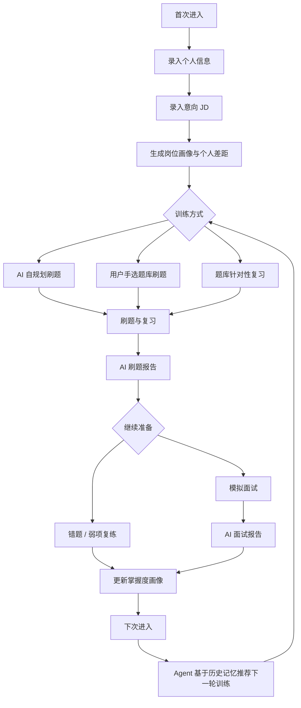
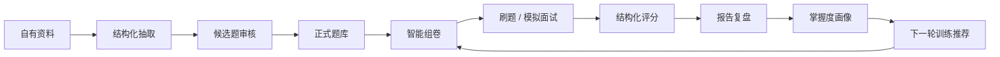
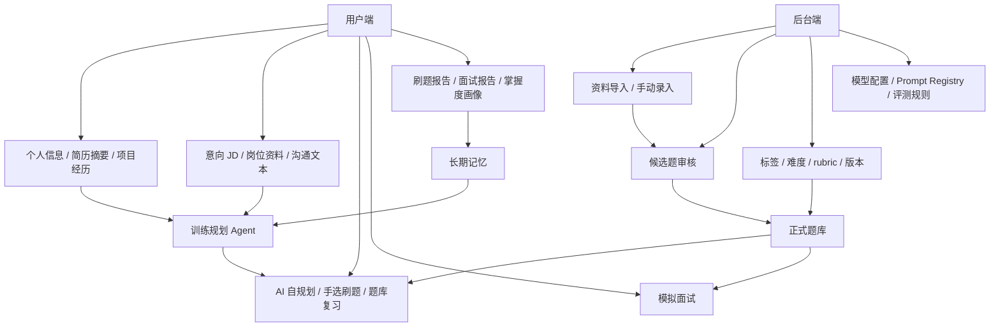

# 面试 Agent 产品需求文档

## 产品定位

面试 Agent 是一个 Agent-native 的个人求职面试准备系统。它不是传统题库站，也不是普通聊天机器人，而是围绕“个人信息 -> 意向 JD -> 训练规划 -> 刷题复习 -> 模拟面试 -> AI 报告 -> 长期记忆 -> 下一轮训练”的完整业务闭环。

系统的题库和资料全部由用户或后台自维护，不涉及爬虫、自动抓取或外部网站采集。AI 只处理用户主动录入、上传或后台维护的资料。

核心目标：

| 目标 | 说明 |
|---|---|
| 自维护题库 | 用户或后台可以通过手动录入、Markdown/CSV/JSON/Excel/PDF/DOCX 文件导入维护题库，系统从已提供资料中抽题、打标签、去重、进入审核。 |
| 用户训练闭环 | 用户录入个人信息和意向 JD 后，可以选择 AI 自规划刷题、手选题库刷题、题库针对性复习和模拟面试。 |
| 粉笔式训练 | 像粉笔刷题一样支持套卷、题卡、计时、交卷、错题本和刷题报告。 |
| Agent 面试官 | 按个人画像、意向 JD 和题库进行多阶段模拟面试，支持追问、提示、评分和结束报告。 |
| 岗位定制 | 基于用户主动录入的 JD、沟通文本和公司背景资料生成岗位画像、匹配分析、准备包和沟通话术。 |
| 长期记忆 | 把每次刷题、复习、模拟面试、报告结果写回个人画像，让下一次推荐更准，形成“Agent 越来越懂你”的体验。 |

## 用户业务闭环

用户端主链路不是“打开题库开始刷题”，而是先建立个人上下文，再由 Agent 持续驱动训练。



| 阶段 | 用户动作 | Agent / 系统动作 | 输出 |
|---|---|---|---|
| 首次进入 | 录入目标岗位、年限、技术栈、项目经历、简历摘要。 | 生成初始个人画像和风险点。 | `UserProfile`、`ProfileSnapshot` |
| 岗位准备 | 粘贴意向 JD、岗位要求、公司背景、沟通文本。 | 生成岗位画像、技能权重、差距分析。 | `JobIntent`、岗位准备建议 |
| 训练规划 | 选择 AI 自规划或手动选题。 | 根据画像、JD、题库和掌握度生成训练路径。 | `TrainingPlan`、`PracticePaper` |
| 刷题复习 | 套卷刷题、按标签复习、看错题/收藏题。 | 保存作答、用时、标记和复习行为。 | `PracticeSession`、`ReviewTask` |
| AI 报告 | 查看刷题报告和复练建议。 | 逐题评分、弱项归因、推荐下一步。 | `PracticeReport`、`MemoryEvent` |
| 模拟面试 | 进入模型面试。 | 基于个人画像、JD、题库、历史报告追问。 | `InterviewSession`、`InterviewReport` |
| 下次回来 | 查看推荐训练。 | 读取长期记忆，推荐更贴合的题单、复习和面试。 | `MasteryProfile`、下一轮计划 |

## 用户与场景

| 用户 | 核心诉求 | 关键场景 |
|---|---|---|
| AI 应用开发 / AI Agent 岗候选人 | 准备 Agent、RAG、Tool Calling、MCP、项目落地等面试。 | 录入个人信息和意向 JD，生成岗位题单，模拟技术面。 |
| 前端转 AI 应用候选人 | 把前端经验转成 AI 应用开发表达。 | 结合项目经历、题库和 JD 生成 AI 前端/Agent 项目追问。 |
| 社招求职者 | 针对不同公司和 JD 快速准备。 | 手动粘贴 JD 和沟通文本，生成准备包、刷题计划和话术。 |
| 个人内容运营者 | 持续维护自己的题库和资料库。 | 在后台导入、审核、去重、打标签、维护 rubric 和组卷策略。 |

## 产品原则

| 原则 | 说明 |
|---|---|
| Agent 优先 | 所有模块都服务于 Agent 工作流：画像、检索、组卷、提问、追问、评分、报告、记忆。 |
| 无爬虫边界 | 不做爬虫、自动抓取、外部网站采集或平台插件读取；外部信息只能由用户主动录入、粘贴或上传。 |
| 自维护题库 | 题库由用户或后台维护，导入来源限定为手动录入、文件导入、结构化导入和用户粘贴文本。 |
| 用户记忆增强 | 每次刷题、复习、面试和报告都要写回长期画像，让下一轮训练更贴合用户。 |
| 双端职责清晰 | 用户端承载训练消费闭环，后台端承载题库资产治理和模型配置。 |
| 结构化闭环 | 每次训练都要保存题目、作答、评分、报告、弱项、记忆事件和下一步计划。 |
| 可追溯 | 题目、答案、资料片段必须保留来源、导入批次、审核状态。 |
| 可控输出 | Agent 输出关键内容必须结构化，可校验、可重试、可人工修正。 |
| 作品感优先 | 项目不是传统排期型外包系统，而是一个体现 Agent 工程能力、产品闭环能力和技术选型判断的个人高质量作品。 |
| 能力闭环优先 | 不按“几周做完几个模块”推进，而按“哪条能力链路已经端到端成立”推进。 |

## 用户端 / 后台端产品结构

| 入口 | 负责范围 | 不负责 |
|---|---|---|
| 用户端 | 个人信息、简历摘要、项目经历、意向 JD、训练计划、AI 自规划刷题、手选刷题、题库复习、模拟面试、报告、画像、下一轮建议。 | 不维护全局题库治理规则，不配置模型和 prompt，不处理候选题发布。 |
| 后台端 | 题库维护、资料导入、候选题审核、标签/知识点/难度、rubric、题目版本、岗位模板、Prompt 版本、模型配置、评测规则。 | 不替用户自动抓取外部平台数据，不代替用户完成个人训练。 |
| Product API | 认证、权限、题库 CRUD、审核流、训练会话、回答评分、报告、画像、Agent Runtime 调用。 | 不写复杂推理 prompt，不让 Agent 绕过业务事实源。 |
| Agent Runtime | 资料理解、抽题、组卷、训练规划、追问、评分、复盘、记忆更新。 | 不接收外部抓取任务，不直接发布正式题，不直接覆盖核心业务表。 |

## 十分级产品验收标准

十分标准不是“功能越多越好”，而是核心闭环能被稳定演示、可追溯、可复测、边界不跑偏。

| 维度 | 十分标准 | 不达标表现 |
|---|---|---|
| 主链路 | 能从首次进入、录入个人信息、录入意向 JD、生成训练规划、刷题、报告、模拟面试、记忆写回完整跑通。 | 只有题库或只有聊天，没有用户长期训练链路。 |
| 后台资产 | 后台能维护资料、候选题、正式题、标签、rubric、模型配置，并能被用户端训练消费。 | 题库只是静态列表，无法治理、审核、追溯。 |
| 输入边界 | 所有资料来自用户或后台提供，系统没有外部读取任务。 | 出现把外部平台读取、自动采集、插件读取作为能力的设计。 |
| Agent 价值 | Agent 负责画像、岗位分析、抽题、组卷、评分、追问、报告、记忆更新，每个输出有结构化 schema。 | Agent 只是一个泛聊天入口，业务状态靠自然语言维持。 |
| 记忆闭环 | 刷题和面试结果能产生 `MemoryEvent`，更新 `MasteryProfile`，影响下一轮推荐。 | 报告生成后没有被系统记住。 |
| 可演示性 | 使用一组固定样例数据，可以在干净环境下稳定演示完整链路。 | 演示依赖临时手工状态或不可复现的模型输出。 |
| 可观测性 | 关键 Agent 调用有 trace、schema result、prompt version、model profile、latency、tokens。 | 出错后不知道哪个 Agent、哪个 prompt、哪个输入导致。 |
| 可维护性 | 用户端、后台端、Product API、Agent Runtime 职责边界固定，不交叉写业务事实。 | 页面直接调模型，Agent 直接改核心表，状态散落。 |

## 端到端演示剧本

这组剧本用于判断产品是否已经从“文档设计”进入“可执行作品”。

| 步骤 | 操作 | 期望结果 | 关键数据 |
|---|---|---|---|
| 1 | 后台上传一份 Markdown 面试资料。 | 生成导入批次和资料片段。 | `SourceResource`、`SourceChunk`、`ImportBatch` |
| 2 | 运行抽题。 | 生成候选题，包含答案、标签、难度、rubric、来源引用。 | `ImportCandidate[]` |
| 3 | 后台审核候选题。 | 编辑、合并或发布候选题，进入正式题库。 | `Question`、`QuestionVersion` |
| 4 | 用户首次进入。 | 录入个人信息、项目经历、简历摘要。 | `UserProfile` |
| 5 | 用户录入意向 JD。 | 生成岗位画像、技能权重和差距分析。 | `JobIntent`、`JobProfile` |
| 6 | Agent 生成训练规划。 | 输出 AI 自规划题单建议，同时允许用户手选题库。 | `TrainingPlan` |
| 7 | 用户选择训练方式。 | 可以进入 AI 推荐题单、手选刷题或题库复习。 | `PracticePaper`、`ReviewTask` |
| 8 | 用户完成刷题。 | 保存作答、用时、标记、交卷状态。 | `PracticeSession`、`PracticeAnswer[]` |
| 9 | 生成刷题报告。 | 输出总评、逐题反馈、弱项、复练建议。 | `EvaluationResult[]`、`PracticeReport` |
| 10 | 进入模拟面试。 | 面试官基于个人画像、JD、题库、历史报告追问。 | `InterviewSession`、`AgentTurn` |
| 11 | 生成面试报告。 | 输出维度评分、项目表达诊断、下一轮建议。 | `InterviewReport` |
| 12 | 下次进入。 | 基于历史报告、错题、掌握度画像推荐下一轮训练。 | `MemoryEvent`、`MasteryProfile` |

## 角色与权限边界

权限设计不是后置商业化能力，而是保护用户私有资料、后台公共题库和 Agent 写入边界的底座。第一阶段就采用 `RBAC + 资源所有权 + 数据作用域`。

| 角色 | 可以做 | 不可以做 |
|---|---|---|
| 普通用户 | 维护个人信息、录入意向 JD、选择训练路径、刷题、复习、模拟面试、查看自己的报告、画像和记忆。 | 发布全局正式题、配置模型、修改全局 prompt、读取其他用户资料。 |
| 题库审核员 | 审核候选题、维护题目标签、知识点、难度和 rubric。 | 读取用户简历、JD、作答、报告和长期记忆。 |
| 后台管理员 | 维护题库、资料导入、审核流、岗位模板、模型配置、Prompt 版本和审计记录。 | 替用户自动读取外部平台数据，绕过审核发布 AI 题目，默认读取用户私有训练资料。 |
| Agent Runtime | 生成候选题、画像、岗位分析、题单建议、评分、报告、记忆事件。 | 直接覆盖用户原始资料，直接发布正式题，直接修改核心业务事实，越权读取非本次工作流资源。 |
| Product API | 持久化业务事实、校验权限、应用状态流转、代理 Agent 调用、写审计日志。 | 承担复杂 prompt 推理，保存未校验模型散文本。 |

权限验收标准：

| 验收项 | 标准 |
|---|---|
| 用户私有隔离 | 用户只能读取自己的个人信息、JD、训练记录、回答、报告、画像和记忆。 |
| 公共题库可消费 | 用户可读取已发布公共题库用于训练，但不能编辑题库资产。 |
| 后台最小权限 | 题库审核员只管理题库域，不默认读取用户私有域。 |
| Agent 授权范围 | Agent 工具调用必须携带 `traceId`、`workflowRunId`、资源范围和服务身份。 |
| 操作可审计 | 发布题目、修改 rubric、切换模型、生成报告、写入记忆等动作必须可追溯。 |

## 核心业务实体与生命周期

业务实体的生命周期必须先定清楚，否则前端、API、Agent 和测试会各自定义状态，后期返工成本很高。

| 实体 | 生命周期 | 完成定义 |
|---|---|---|
| 题目 | `draft -> published -> disabled -> archived` | 进入 `published` 前必须有题干、答案、rubric、标签、知识点、难度、来源或人工创建标记。 |
| 候选题审核 | `candidate -> needs_edit / approved / merged / rejected -> published` | AI 生成内容不能直接进入正式题库，必须经过人工审核或明确发布动作。 |
| 导入任务 | `created -> parsing -> extracting -> validating -> deduplicating -> waiting_review -> published / failed` | 导入必须有来源、状态、错误记录、候选题数量和审核结果。 |
| 训练计划 | `planning -> ready -> active -> completed / cancelled` | 计划必须能解释题单来源：画像、JD、掌握度、标签或用户手选。 |
| 刷题会话 | `draft -> in_progress -> submitted / timeout_submitted -> evaluating -> report_ready -> memory_updated` | 一次训练必须保留题目版本、用户答案、用时、评分和报告。 |
| 模拟面试 | `warmup -> self_intro -> tech_basics -> jd_core -> project_deep_dive -> scenario_design -> hr -> final_evaluation -> report_ready -> memory_updated` | 面试必须逐轮记录问题、回答、追问、评分依据和最终报告。 |
| 报告 | `generating -> ready -> archived / failed` | 报告必须同时有可读版和机器可读 JSON 摘要，并能产出记忆事件。 |
| 掌握度画像 | `initialized -> updating -> stable_snapshot` | 画像不能被报告直接覆盖，只能由 `MemoryEvent` 和评分证据增量更新。 |
| 用户记忆 | `captured -> validated -> applied -> superseded` | 每条记忆必须有来源、证据、置信度和影响范围。 |

## 开发口径调整

本项目不采用传统项目管理里的“一周、两周、三周”节奏来定义价值。正确口径是：

```text
先证明核心能力闭环
再扩展场景覆盖
最后强化自动化、评估、记忆和体验
```

### 满分前期准备标准

| 维度 | 满分标准 |
|---|---|
| 产品闭环 | 至少有一条从资料导入到训练反馈再到画像写回的完整闭环。 |
| Agent 价值 | Agent 不只是聊天，而是承担抽取、检索、组卷、追问、评分、报告、记忆更新等明确职责。 |
| 技术含量 | 能体现 LangGraph 状态机、结构化输出、RAG 检索、模型路由、可观测性、评估集和长期记忆。 |
| 数据结构 | 核心实体、状态流转、评分结构、报告结构都能落到明确 schema。 |
| 可演示性 | 任意导入一份资料，可以稳定演示候选题生成、审核、刷题、报告和下一轮训练建议。 |
| 可扩展性 | 岗位资料分析、模拟面试、项目深挖、语音等增强能力可以自然接入，而不是推翻已有架构。 |

## Agent-native 核心闭环

项目的核心不是“功能列表”，而是下面这条可持续进化的能力链：



这条链路成立后，岗位资料分析、项目深挖、HR 话术、语音面试都只是新的输入和新的训练形态，不会改变系统主架构。

## 总体功能地图



## 功能模块

### 1. 资料与题库导入

| 功能 | 描述 | 能力级别 |
|---|---|---|
| Markdown 导入 | 导入 Obsidian 笔记、README、题库 md 文件。 | 核心 |
| Excel / CSV 导入 | 使用模板批量导入题目、答案、标签、难度。 | 核心 |
| JSON 导入 | 支持结构化题库和其他系统导出数据。 | 核心 |
| 手动新建题目 | 表单录入题目、答案、解析、追问、评分点。 | 核心 |
| PDF / DOCX 导入 | AI 从资料中抽取候选题。 | 增强 |
| 项目资料导入 | 支持用户上传或粘贴 README、docs、Markdown、项目说明文本，生成资料来源和候选题；系统不主动拉取外部仓库。 | 增强 |
| AI 抽题 | 从非结构化资料中抽取题目、答案、考点、追问。 | 核心 |
| 导入任务日志 | 展示解析进度、成功数、失败数、重复数。 | 核心 |

导入结果不直接进入正式题库，而是进入候选题审核区。

### 2. 题库治理

| 功能 | 描述 | 能力级别 |
|---|---|---|
| 候选题审核 | 编辑、发布、驳回、合并候选题。 | 核心 |
| 标签体系 | 技术、岗位、公司、轮次、题型标签。 | 核心 |
| 难度校准 | AI 初判难度，人工可调整。 | 核心 |
| 来源追踪 | 来源类型、文件名、用户提供文本、资料片段、导入批次。 | 核心 |
| 去重合并 | 标题相似、语义相似、同考点合并建议。 | 核心 |
| 质量分 | 答案完整度、rubric、追问、来源可信度。 | 增强 |
| 题目版本 | 题目修改保留历史版本。 | 增强 |

### 3. 粉笔式刷题

| 功能 | 描述 | 能力级别 |
|---|---|---|
| 专项练习 | 按标签/领域刷题，如 React、RAG、MCP、Prompt。 | 核心 |
| 模拟套卷 | 按题型、难度、领域比例组卷。 | 核心 |
| 岗位题单 | 根据用户主动录入的意向 JD、岗位要求和沟通文本生成定向题单。 | 核心 |
| 计时答题 | 总计时、单题用时、剩余时间。 | 核心 |
| 题卡导航 | 未答、已答、标记、跳过一目了然。 | 核心 |
| 作答区 | 简答、选择、代码、场景题输入。 | 核心 |
| 标记/收藏 | 不会、待复习、收藏。 | 核心 |
| 交卷 | 主动交卷或超时自动交卷。 | 核心 |
| 错题本 | 错题自动进入错题本，可按标签复练。 | 核心 |

### 4. 刷题报告

刷题报告是粉笔式体验的关键，不是附属功能。

| 报告块 | 内容 |
|---|---|
| 总览 | 总分、完成率、正确率、总用时、平均用时。 |
| 维度得分 | 按标签/模块统计：React、RAG、MCP、项目表达、HR。 |
| 逐题反馈 | 用户答案、参考答案、评分点覆盖、缺失点、改写建议。 |
| 错题归因 | 概念不熟、表达不完整、项目证据不足、场景思考弱。 |
| 推荐复练 | 下一套题、错题复练、相关知识笔记、模拟面试建议。 |
| 成长记录 | 写入掌握度画像，形成趋势。 |

### 5. 模拟面试

| 功能 | 描述 | 能力级别 |
|---|---|---|
| 面试模式 | 通用技术面、JD 定向面、项目深挖、AI Agent 专项、HR 面、谈薪面。 | 核心 |
| 面试难度 | 初级、中级、高级、冲刺。 | 核心 |
| 面试官风格 | 温和、严格、追问型、大厂技术面、主管面、HR 面。 | 增强 |
| 面试套卷 | 从题库和岗位画像中生成面试问题。 | 核心 |
| 逐题提问 | AI 面试官逐题推进，不一次性展示全部问题。 | 核心 |
| 自适应追问 | 答弱追基础，答强追生产、取舍、边界。 | 核心 |
| 提示按钮 | 用户卡住可要提示，报告记录提示次数。 | 核心 |
| 实时记录 | 保存问题、回答、追问、评分、用时。 | 核心 |
| 语音模式 | STT/TTS/录音复盘。 | 后置 |

面试阶段：

| 阶段 | 目的 |
|---|---|
| 开场与自我介绍 | 训练岗位匹配表达。 |
| 基础技术 | 检查核心知识。 |
| 岗位核心题 | 围绕 JD 必备技能。 |
| 项目深挖 | 深挖项目架构、难点、取舍、故障和结果。 |
| 场景设计 | 考察工程落地和方案能力。 |
| 行为面 / HR | 稳定性、沟通、离职原因、薪资期望。 |
| 反问 | 训练高质量反问。 |

### 6. 面试报告

| 报告块 | 内容 |
|---|---|
| 总评 | 总分、建议等级、是否达到目标岗位要求。 |
| 维度评分 | 技术深度、项目表达、问题解决、沟通结构、岗位匹配、追问应对。 |
| 逐题复盘 | 问题、回答、追问、评分、缺失点、高分答案。 |
| 项目表达诊断 | 哪些项目亮点清楚，哪些缺少数据/证据/细节。 |
| JD 匹配诊断 | 当前岗位强项、风险和补强方向。 |
| 话术改写 | 自我介绍、项目介绍、沟通文本、HR 表达的改写版本。 |
| 下一轮训练 | 推荐题单、错题、项目深挖题、HR 题、复习资料。 |

### 7. 岗位资料与沟通文本管理

| 功能 | 描述 | 能力级别 |
|---|---|---|
| 意向 JD 录入 | 用户手动粘贴 JD、岗位要求、公司背景和沟通文本。 | 核心 |
| 岗位画像 | 技能权重、业务场景、面试重点、风险信号。 | 核心 |
| 匹配度分析 | 与简历、项目经历、历史训练和掌握度画像对比。 | 核心 |
| 准备包 | 题单、项目深挖、沟通话术、反问清单。 | 核心 |
| 沟通话术 | 开场、追问、争取面试、项目亮点、催反馈、谈薪。 | 核心 |
| 机会状态 | 待沟通、已投递、约面、一面、二面、HR、offer、放弃。 | 增强 |
| 来源边界 | 只处理用户主动录入、粘贴或上传的岗位资料，不提供外部平台自动读取能力。 | 核心 |

### 8. 个人画像与成长

| 功能 | 描述 | 能力级别 |
|---|---|---|
| 简历画像 | 从简历提取技能、项目、年限、亮点、风险。 | 核心 |
| 项目卡片 | 背景、职责、技术栈、难点、结果、证据、追问点。 | 核心 |
| 能力雷达 | 按标签统计掌握度和面试表现。 | 增强 |
| 弱项追踪 | 刷题和面试报告持续更新。 | 核心 |
| 训练计划 | 自动推荐下一轮刷题、模拟面试和资料复习。 | 增强 |
| 简历改写建议 | 根据岗位和报告优化简历 bullet。 | 增强 |

## Agent 能力设计

| Agent | 输入 | 输出 | 主要工具 |
|---|---|---|---|
| `ImportAgent` | 文件、文本、Markdown/CSV/JSON、用户提供材料 | 候选题、标签、难度、来源 | 解析器、去重、题库写入 |
| `GoalAgent` | 目标岗位、准备时间、个人画像 | 训练目标和计划 | 岗位画像、个人画像 |
| `PracticeCoachAgent` | 题单、作答记录 | 刷题报告、复练建议 | 评分、错题、掌握度 |
| `MockInterviewerAgent` | 岗位、题单、简历 | 下一题、追问、阶段推进 | 题库检索、状态机 |
| `EvaluatorAgent` | 问题、答案、rubric | 分数、缺失点、高分答案 | rubric、模型评分 |
| `ReportAgent` | 刷题/面试记录 | Markdown 报告和 JSON 摘要 | 报告模板、画像写回 |
| `CommunicationScriptAgent` | 意向 JD、沟通文本、个人画像 | 沟通话术 | 话术模板、风险判断 |

## 能力切片与完成定义

本项目不按固定周期开工，而按能力切片推进。每个切片必须有输入、处理过程、结构化输出、可视化结果和可复现样例。

### 核心能力切片

| 能力切片 | 输入 | 核心处理 | 输出 | 完成定义 |
|---|---|---|---|---|
| 资料导入与抽题 | Markdown / CSV / JSON / 手动题目 | 解析、切分、抽题、打标签、去重 | `ImportCandidate[]` | 一份 Markdown 资料可稳定抽出候选题，并保留来源。 |
| 候选题治理 | 候选题、来源、AI 建议 | 编辑、合并、发布、驳回、质量评分 | 正式题库题目 | 每道正式题都有答案、rubric、标签、来源和审核状态。 |
| 智能组卷 | 标签、难度、岗位目标、训练模式 | 规则筛选 + 检索增强 + 覆盖度控制 | `PracticePaper` | 能生成一套结构均衡、难度可控的 10-20 题训练。 |
| 粉笔式刷题 | 套卷、题目、计时设置 | 作答、标记、跳题、交卷 | `PracticeSession` + `PracticeAnswer[]` | 用户能完整完成一套训练并保留过程数据。 |
| 结构化评分 | 题目、参考答案、rubric、用户答案 | 规则评分 + LLM 评分 + 缺失点抽取 | `EvaluationResult[]` | 每题有分数、依据、缺失点、高分答案和置信度。 |
| 报告复盘 | 作答记录、评分结果、画像上下文 | 聚合、归因、建议、复练推荐 | `PracticeReport` | 报告既有 Markdown 可读版，也有 JSON 摘要可写回画像。 |
| 模拟面试 | 岗位目标、简历画像、题库 | 状态机推进、追问、提示、评分 | `InterviewSession` + `InterviewReport` | 面试官能按阶段逐题推进，并生成逐题复盘。 |
| 岗位资料准备 | 意向 JD、沟通文本、简历画像 | 岗位画像、风险识别、题单生成、话术改写 | 准备包 + 沟通话术 | 输入一段 JD 后能生成训练题单、项目追问和沟通话术。 |
| 长期记忆 | 报告、错题、面试表现 | 掌握度更新、弱项追踪、下一轮推荐 | `MasteryProfile` | 同一标签下多次训练能形成趋势和推荐。 |

### 第一条必须打穿的高价值闭环

虽然不按周计划推进，但第一条工程闭环必须明确。推荐先打穿：

```text
Markdown 导入
  -> ImportAgent 抽题
  -> 候选题审核
  -> 正式题库
  -> 智能组卷
  -> 粉笔式刷题
  -> EvaluatorAgent 评分
  -> ReportAgent 生成报告
  -> MasteryProfile 写回
```

这条链路打穿后，项目就从“资料项目”进入“Agent 产品原型”。

## 技术含量展示点

| 展示点 | 用户能感知到什么 | 工程上体现什么 |
|---|---|---|
| 结构化抽题 | 导入资料后不是生成一堆散文本，而是生成可审核题目。 | schema-first extraction、来源追踪、去重合并。 |
| 自适应训练 | 题单不是随机题，而是基于目标和弱项生成。 | profile-aware retrieval、coverage control、difficulty balancing。 |
| 逐题评分 | 不只是给总分，而是指出评分点覆盖和缺失。 | rubric grading、LLM judge、置信度和人工修正。 |
| 面试追问 | 面试官能根据回答继续深入。 | LangGraph 状态机、turn memory、question policy。 |
| 报告写回 | 每次训练会影响下一轮推荐。 | long-term memory、mastery update、event sourcing。 |
| 模型可配置 | 不同任务可选择不同模型。 | model router、fallback、budget、observability。 |

## 成功指标

| 指标 | 说明 |
|---|---|
| 导入成功率 | 导入资料中成功生成候选题的比例。 |
| 候选题发布率 | 候选题审核后进入正式题库的比例。 |
| 题目可用率 | 正式题中具备答案、rubric、标签、来源的比例。 |
| 套卷完成率 | 用户开始套卷后完成交卷的比例。 |
| 报告查看率 | 交卷/面试后查看报告的比例。 |
| 错题复练率 | 报告推荐错题后再次练习的比例。 |
| 弱项改善 | 同标签多次训练得分是否提升。 |
| 岗位准备转化 | 岗位资料分析后是否生成题单或模拟面试。 |
| Agent 稳定性 | 结构化输出校验通过率、重试率、失败恢复率。 |

## 不做清单

为了保证项目技术含量集中，以下能力不作为第一条闭环的前置条件：

| 暂不优先 | 原因 |
|---|---|
| 浏览器插件自动读取外部平台 | 合规和授权边界复杂，先用手动粘贴输入证明产品价值，本项目不把外部平台读取作为产品能力。 |
| 实时面试 Copilot | 合规风险高，且会稀释训练产品的主线。 |
| 语音 STT/TTS | 体验增强项，不影响 Agent 核心闭环。 |
| 多人协作后台 | 当前定位是个人求职准备系统，先做单用户高质量闭环。 |
| 大而全题库站 | 项目核心是自有资料和 Agent 训练，不是做公开题库门户。 |
| 复杂商业化权限 | 先证明 Agent 价值，再考虑订阅、团队、公开分享。 |

## 第一版验收样例

| 样例 | 验收方式 |
|---|---|
| 输入一份 Agent/RAG 面试 Markdown | 系统抽出不少于 10 道候选题，并展示来源片段。 |
| 发布 10 道正式题 | 每道题有标签、难度、参考答案、rubric 和来源。 |
| 生成一套专项训练 | 套卷包含基础、场景、项目表达三类题。 |
| 完成一次刷题 | 保留答题时间、标记、答案和交卷状态。 |
| 生成刷题报告 | 报告包含总分、逐题反馈、弱项归因、复练建议。 |
| 写回掌握度画像 | 至少更新 3 个标签的掌握度和下一轮推荐。 |
| 生成一次岗位准备包 | 输入用户主动提供的 JD 后输出岗位画像、题单、项目追问和沟通话术。 |
