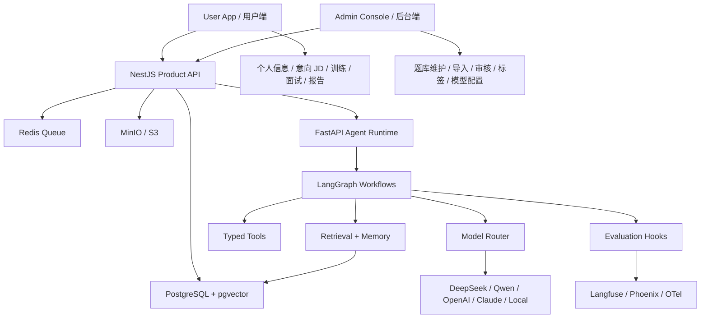

# 面试 Agent 前期准备冻结稿

## 1. 结论

本项目不是传统排期型开发项目，而是一个 Agent-native 的个人求职训练作品。目标不是按“一周两周三周”拆任务，而是把核心能力闭环做扎实，并体现足够清晰、前沿、有技术含量的工程设计。

最终准备目标：

```text
让任何开发者看到资料后，都能清楚知道：
产品要解决什么问题
第一条能力闭环是什么
Agent 如何协作
数据如何流转
模型如何接入
状态如何推进
报告如何生成
质量如何评估
哪些东西暂时不做
```

## 2. 项目定位冻结

| 项 | 冻结结论 |
|---|---|
| 产品类型 | Agent-native 面试训练系统。 |
| 核心用户 | AI 应用开发 / AI Agent 岗候选人、前端转 AI 应用候选人、社招求职者。 |
| 核心资产 | 自维护题库、个人信息、意向 JD、项目经历、训练记录、刷题报告、面试报告、长期记忆画像。 |
| 不是 | 不是公开题库站，不是普通聊天机器人，不是简历模板站，不是实时作弊 Copilot，不是爬虫或外部平台采集工具。 |
| 核心体验 | 用户首次录入个人信息和意向 JD 后，系统能规划训练、支持手选刷题、题库复习、生成报告、模拟面试，并在下次进入时基于记忆推荐下一轮训练。 |
| 技术表达 | LangGraph 状态机、结构化输出、RAG、模型路由、可观测性、评估闭环、长期记忆。 |

## 3. 双闭环冻结

本项目必须同时成立两条闭环。后台闭环负责题库资产成为可训练资产，用户闭环负责让训练结果沉淀为长期记忆。

### 后台题库资产闭环

```text
用户/后台提供资料
  -> ImportAgent 抽题
  -> 候选题审核
  -> 正式题库
  -> 标签 / rubric / 版本治理
  -> 可被组卷、刷题、复习、模拟面试引用
```

### 用户训练业务闭环

```text
个人信息
  -> 意向 JD
  -> ProfileAgent / JobIntentAgent 生成画像
  -> TrainingPlannerAgent 训练规划
  -> AI 自规划刷题 / 用户手选刷题 / 题库复习
  -> AI 刷题报告 / 模拟面试报告
  -> MemoryAgent 写回长期记忆画像
  -> 下次进入推荐下一轮训练
```

这两条链路是系统地基。它们成立后，项目深挖、语音面试、更多岗位模板都只是扩展输入和扩展训练形态。

## 4. 十分执行标准冻结

十分标准是“实现团队拿到文档后，不需要再猜模块边界、状态流、验收方式”。如果实现时出现不确定性，按本节优先级裁决。

| 优先级 | 冻结项 | 裁决规则 |
|---|---|---|
| 1 | 输入边界 | 只处理用户或后台提供资料；任何外部读取任务都不进入架构。 |
| 2 | 业务事实源 | Product API 是业务事实源；Agent 只返回结构化建议、报告或事件。 |
| 3 | 双端职责 | 用户端做训练消费，后台端做资产治理；两端不互相侵入。 |
| 4 | 状态机 | 导入、审核、训练、报告、面试、记忆必须走显式状态，不靠临时文本。 |
| 5 | 结构化输出 | Agent 输出必须先过 schema，再允许入库或展示为关键结论。 |
| 6 | 记忆写回 | 没有 `MemoryEvent` 和 `MasteryProfile` 写回，不算完成训练闭环。 |
| 7 | 可复测 | 每条闭环必须有 fixture、seed data、golden case 或 e2e 路径。 |

### 十分演示验收剧本

| 剧本 | 输入 | 必须看到的结果 |
|---|---|---|
| 后台资产剧本 | 一份 Markdown 资料。 | `SourceResource -> ImportCandidate -> Question` 全链路可追溯。 |
| 用户画像剧本 | 个人信息、简历摘要、项目经历。 | 生成 `ProfileSnapshot`，包含优势、短板、风险点。 |
| 岗位意图剧本 | 用户主动提供的 JD 和沟通文本。 | 生成 `JobProfile`，包含技能权重、面试重点、差距分析。 |
| 训练路径剧本 | 正式题库、画像、岗位画像。 | 能生成 AI 自规划题单，也能改走手选刷题或题库复习。 |
| 刷题报告剧本 | 一次完整作答。 | 生成逐题评分、弱项归因、下一轮建议和记忆事件。 |
| 模拟面试剧本 | 画像、JD、题库、历史报告。 | 面试官能追问，结束后生成面试报告。 |
| 下次进入剧本 | 历史报告、错题、面试表现。 | 推荐下一轮训练，并解释推荐依据。 |

## 5. 技术选型冻结

| 层级 | 选型 | 冻结理由 |
|---|---|---|
| Web App | Next.js App Router + React Server Components + Tailwind + shadcn/ui | 现代前端体验好，适合做高质感刷题页、报告页、配置页。 |
| Product API | NestJS + Prisma + OpenAPI | 模块边界清晰，适合承载题库、训练、报告、画像等业务事实。 |
| Agent Runtime | Python + FastAPI + LangGraph + Pydantic v2 | Agent 状态机、结构化输出、RAG、评估生态更成熟。 |
| Database | PostgreSQL + pgvector | 同时承载业务数据和向量检索，避免早期引入过重基础设施。 |
| Queue | Redis + BullMQ / Python Worker | 导入、抽题、向量化、评分、报告生成需要异步化。 |
| File Storage | MinIO / S3-compatible | 统一管理导入文件、简历、附件、报告产物。 |
| Model Router | LiteLLM 风格 adapter / OpenAI-compatible adapter | 支持 DeepSeek、Qwen、OpenAI、Claude、本地模型切换和 fallback。 |
| Observability | OpenTelemetry + Langfuse / Phoenix | Agent trace、prompt、tokens、cost、latency、schema 失败必须可观察。 |
| Evaluation | Golden dataset + schema validation + LLM judge + 人工审核 | 让抽题、评分、报告质量可持续变好。 |
| Realtime | SSE 优先，WebSocket 后置 | 导入进度、报告生成、面试流式输出用 SSE 足够清晰。 |

## 6. 系统边界冻结



### 边界规则

| 模块 | 负责 | 不负责 |
|---|---|---|
| 用户端 | 个人信息、意向 JD、刷题、复习、模拟面试、报告阅读、画像查看 | 不维护全局题库治理规则，不配置模型和 Prompt。 |
| 后台端 | 题库维护、资料导入、候选题审核、标签/rubric、模型配置、Prompt 版本 | 不替用户自动读取外部平台数据，不代替用户训练。 |
| Product API | 业务事实源、权限、事务、审计、持久化 | 不写复杂 prompt，不承担多轮推理。 |
| Agent Runtime | 状态机、模型调用、工具编排、结构化输出 | 不绕过业务 API 任意改核心数据，不接收外部抓取任务。 |
| Worker | 长任务、批量处理、向量化、报告生成 | 不承载用户实时交互状态。 |
| Database | 业务状态、报告、画像、向量 | 不保存无来源、无结构的散乱结论。 |

## 7. 核心领域模型冻结

| 模型 | 含义 | 必备字段 |
|---|---|---|
| `UserProfile` | 用户个人信息 | `id`、`targetRole`、`years`、`techStacks`、`resumeSummary`、`projectExperiences`、`currentLevel` |
| `ProfileSnapshot` | Agent 生成的阶段性用户画像 | `profileId`、`strengths`、`weaknesses`、`riskSignals`、`skillMap`、`createdAt` |
| `JobIntent` | 用户主动录入的意向 JD 和岗位资料 | `id`、`jdText`、`companyContext`、`communicationText`、`targetRole`、`status` |
| `JobProfile` | 岗位画像和差距分析 | `jobIntentId`、`skillWeights`、`interviewFocus`、`riskSignals`、`prepAdvice` |
| `SourceResource` | 用户或后台提供的导入资料来源 | `id`、`sourceType`、`ownerType`、`title`、`hash`、`fileRef`、`textRef`、`metadata` |
| `SourceChunk` | 可检索片段 | `id`、`sourceId`、`content`、`locator`、`embedding`、`tokenCount` |
| `ImportBatch` | 一次导入任务 | `id`、`status`、`sourceIds`、`stats`、`error` |
| `ImportCandidate` | AI 抽出的候选题 | `stem`、`answer`、`tags`、`difficulty`、`rubric`、`sourceRefs`、`qualityScore`、`status` |
| `Question` | 正式题 | `stem`、`answer`、`analysis`、`tags`、`difficulty`、`rubric`、`sourceRefs`、`version` |
| `TrainingPlan` | AI 生成或用户自选的训练计划 | `userId`、`jobIntentId`、`mode`、`goals`、`tasks`、`status`、`nextActions` |
| `QuestionVersion` | 题目版本历史 | `questionId`、`version`、`snapshot`、`reason`、`editorId` |
| `PracticePaper` | 套卷/题单 | `mode`、`goal`、`questionIds`、`composition`、`timeLimit` |
| `ReviewTask` | 针对错题、弱项、收藏题、标签题的复习任务 | `userId`、`source`、`questionIds`、`tags`、`reason`、`status` |
| `PracticeSession` | 一次训练 | `paperId`、`status`、`startedAt`、`submittedAt`、`score` |
| `PracticeAnswer` | 单题作答 | `questionId`、`answer`、`elapsedMs`、`flags`、`status` |
| `EvaluationResult` | 单题评分 | `score`、`coveredPoints`、`missingPoints`、`feedback`、`confidence` |
| `PracticeReport` | 刷题报告 | `summary`、`dimensionScores`、`questionFeedback`、`weaknesses`、`recommendations`、`memoryEvents` |
| `AgentSession` | Agent 会话 | `type`、`state`、`workflowRunId`、`metadata` |
| `AgentTurn` | 单轮 Agent 交互 | `role`、`content`、`structuredPayload`、`traceId` |
| `InterviewReport` | 面试报告 | `overall`、`stageScores`、`turnFeedback`、`projectDiagnosis`、`nextActions`、`memoryEvents` |
| `MemoryEvent` | 可追溯记忆事件 | `userId`、`eventType`、`sourceId`、`evidence`、`delta`、`createdAt` |
| `MasteryProfile` | 长期掌握度 | `tag`、`score`、`confidence`、`evidenceCount`、`trend` |
| `ModelProfile` | 模型配置 | `provider`、`model`、`params`、`fallback`、`budget`、`schemaMode` |
| `PromptVersion` | Prompt 版本 | `key`、`version`、`template`、`inputSchema`、`outputSchema`、`evalSet` |

### 数据模型冻结范围

数据库 schema 先于 API、页面和 Agent 实现冻结。第一阶段不追求把未来所有字段做满，但核心表、关系、状态枚举、索引和权限字段必须一次定准，避免实现阶段反复返工。

| 域 | 第一阶段必须冻结 | 可后续增强 |
|---|---|---|
| 身份与权限 | `tenants`、`users`、`roles`、`permissions`、`role_permissions`、`user_roles` | `api_keys`、`support_access_grants`、商业化订阅表 |
| 用户画像与资料 | `user_profiles`、`resumes`、`project_experiences`、`job_intents`、`profile_snapshots`、`job_profiles`、`user_assets` | 画像变更申请、外部分享记录 |
| 题库资产 | `questions`、`question_versions`、`question_options`、`question_tags`、`tags`、`knowledge_points`、`job_directions` | 题集、质量指标、协作编辑 |
| 候选题与审核 | `question_candidates`、`review_tasks`、`review_records`、`import_tasks`、`import_task_items` | 去重分组、批量审核策略 |
| 训练与刷题 | `training_plans`、`training_plan_items`、`practice_papers`、`practice_sessions`、`practice_session_items`、`user_answers`、`answer_scores` | 收藏夹、错题本高级统计 |
| 模拟面试 | `interview_sessions`、`interview_turns`、`followup_questions` | 阶段指标、面试官风格实验 |
| 报告与掌握度 | `reports`、`report_sections`、`mastery_profiles`、`mastery_snapshots`、`weak_points`、`review_recommendations` | 趋势看板、成长曲线 |
| Agent 与模型 | `agent_runs`、`agent_run_steps`、`llm_providers`、`model_configs`、`prompt_templates`、`rubrics`、`rubric_versions` | 评估集管理、模型实验记录 |
| 记忆与检索 | `user_memories`、`memory_events`、`embedding_documents`、`embedding_chunks`、`retrieval_logs` | rerank 日志、召回质量看板 |
| 审计与来源 | `audit_logs`、`source_documents`、`source_policy_records` | 数据导出任务、合规审批流 |

冻结规则：

| 规则 | 裁决 |
|---|---|
| 不允许因为页面方便绕过核心表 | 页面字段不合适时改 DTO，不改业务事实源。 |
| 不允许 Agent 直接写核心状态 | Agent 输出先落结构化结果，再由 Product API 应用状态流转。 |
| 不允许私有资料和公共题库混表无边界 | 必须有 `tenant_id`、`user_id`、`visibility_scope` 或等价字段。 |
| 不允许报告直接覆盖画像 | 报告只能产出 `MemoryEvent`，画像由规则引擎增量更新。 |
| 不允许新增未登记状态 | 新状态必须同步 schema、枚举、测试和文档。 |

### pgvector 与检索层冻结

| 项 | 冻结结论 |
|---|---|
| 向量库 | 使用 PostgreSQL + pgvector，不先引入独立向量数据库。 |
| 统一分块表 | 使用 `embedding_documents` + `embedding_chunks` 承载题目、答案、报告、简历、项目、JD、知识点、用户记忆。 |
| 检索边界 | 检索前先按 `tenant_id`、`owner_user_id`、`visibility_scope`、`entity_type`、`source_type` 过滤，再做向量召回和重排。 |
| 权限隔离 | 用户私有资料只服务本人训练；后台公共题库可用于训练消费；后台不默认读取用户私有报告和记忆。 |
| 可回放 | 每次训练规划、组卷、面试追问、下一轮推荐都写入 `retrieval_logs`。 |
| 索引 | `embedding_chunks` 建权限过滤索引、全文 GIN 索引和 pgvector HNSW 或 IVFFLAT 索引。 |

### 权限底座冻结

权限从第一阶段开始建设，不作为后续装饰。采用 `RBAC + 资源所有权 + 数据作用域`，默认拒绝、显式授权、关键动作审计。

| 角色 | 默认作用域 |
|---|---|
| `candidate_user` | 只能管理自己的画像、JD、训练、回答、报告、记忆；可读取已发布公共题库。 |
| `question_curator` | 管理题库、候选题、标签、知识点和 rubric；不能读取用户私有训练资料。 |
| `admin` | 管理后台资产、模型配置、Prompt 版本和审计；默认不读取用户私有明细。 |
| `super_admin` | 管理租户、角色、权限和系统配置；高风险操作必须审计。 |
| `agent_service` | 只读取本次工作流授权资源；只能写结构化结果、运行日志和允许的事件。 |

权限验收：用户横向越权读取必须失败；后台审核员读取用户简历、JD、报告、记忆必须失败；Agent 无 `workflow_run_id` 或资源授权范围时工具调用必须失败；公共题库读取必须能支撑用户训练。

## 8. Agent 契约冻结

| Agent | 输入 | 输出 | 允许工具 | 写入策略 |
|---|---|---|---|---|
| `ImportAgent` | source text、source metadata、taxonomy | `ImportCandidate[]` | 文本解析、去重检索、候选题写入 | 只写候选题，不直接发布正式题。 |
| `QuestionCuratorAgent` | candidate、similar questions、taxonomy | 审核建议、合并建议、rubric 补全 | 题库检索、相似度计算 | 只写建议，最终发布由用户确认。 |
| `ProfileAgent` | 用户个人信息、简历摘要、项目经历 | `ProfileSnapshot` | 画像读取、项目经历解析 | 生成画像快照，不直接覆盖用户原始资料。 |
| `JobIntentAgent` | 用户主动录入的 JD、岗位要求、沟通文本 | `JobProfile` | 画像读取、题库检索 | 只分析用户提供资料，不读取外部平台。 |
| `TrainingPlannerAgent` | profile、job profile、mastery、question coverage | `TrainingPlan` | 题库检索、画像读取、掌握度读取 | 生成 AI 自规划和下一轮建议，由 Product API 创建计划。 |
| `PaperComposerAgent` | goal、profile、tags、difficulty | `PracticePaperPlan` | 题库检索、画像读取 | 生成题单计划，由 Product API 创建套卷。 |
| `ReviewCoachAgent` | wrong questions、weaknesses、favorites、mastery | `ReviewTask[]` | 题库检索、报告读取 | 生成错题、收藏、弱项复习任务。 |
| `EvaluatorAgent` | question、rubric、answer、context | `EvaluationResult` | rubric 读取、参考答案读取 | 不写画像，只返回评分结果。 |
| `PracticeReportAgent` | session、answers、evaluations、profile | `PracticeReport` | 报告模板、画像读取 | 返回报告和 memory events。 |
| `MockInterviewerAgent` | interview state、profile、paper、last answer | next question / follow-up / finish action | 题库检索、画像读取、turn 写入 | 通过状态机写入面试 turn。 |
| `MemoryAgent` | report summary、evaluation events | `MemoryEvent[]`、`MasteryUpdate[]` | 历史表现读取 | 生成画像更新事件，由 Product API 应用。 |

## 9. 状态机冻结

### 导入任务

```text
Created -> Parsing -> Extracting -> Validating -> Deduplicating -> WaitingReview -> Published
                                                         └-> Failed -> Retrying
```

### 候选题审核

```text
Candidate -> NeedsEdit -> Approved -> Published
Candidate -> Merged
Candidate -> Rejected
Published -> Archived
```

### 用户训练主状态

```text
Onboarding -> ProfileReady -> JobIntentReady -> PlanReady -> Practicing -> ReportReady -> InterviewReady -> MemoryUpdated -> NextPlanReady
NextPlanReady -> Practicing
```

### 刷题训练

```text
Draft -> InProgress -> Submitted -> Evaluating -> ReportReady -> MemoryUpdated
InProgress -> Paused -> InProgress
InProgress -> TimeoutSubmitted -> Evaluating
Evaluating -> EvaluationFailed -> Evaluating
```

### 模拟面试

```text
Warmup -> SelfIntro -> TechBasics -> JDCore -> ProjectDeepDive -> ScenarioDesign -> HR -> CandidateQuestions -> FinalEvaluation -> ReportReady -> MemoryUpdated
```

## 10. 核心结构化输出冻结

### `ImportCandidate`

```json
{
  "stem": "什么是 RAG？它解决了什么问题？",
  "answer": "RAG 通过检索外部知识增强模型回答，主要解决知识过期、私有知识缺失和幻觉问题。",
  "tags": ["RAG", "LLM", "AI应用开发"],
  "difficulty": "basic",
  "questionType": "short_answer",
  "rubric": [
    { "point": "说明检索增强生成", "score": 2 },
    { "point": "说明外部知识来源", "score": 2 },
    { "point": "说明降低幻觉或补充私有知识", "score": 2 }
  ],
  "sourceRefs": [
    { "sourceId": "src_001", "chunkId": "chk_003", "locator": "rag.md#L12-L26" }
  ],
  "qualityScore": 0.86
}
```

### `EvaluationResult`

```json
{
  "questionId": "q_001",
  "score": 4,
  "maxScore": 6,
  "coveredPoints": ["说明检索增强生成", "说明外部知识来源"],
  "missingPoints": ["没有说明降低幻觉或补充私有知识"],
  "feedback": "回答抓住了 RAG 的基本定义，但缺少工程价值和适用边界。",
  "betterAnswer": "RAG 是检索增强生成，通过先从外部知识库召回相关资料，再把资料作为上下文交给 LLM 生成答案。它主要解决模型知识过期、私有知识无法覆盖、回答幻觉等问题。",
  "confidence": 0.82
}
```

### `PracticeReport`

```json
{
  "summary": {
    "score": 78,
    "completionRate": 1,
    "accuracy": 0.7,
    "totalTimeMs": 1260000
  },
  "dimensionScores": [
    { "tag": "RAG", "score": 82, "trend": "up" },
    { "tag": "MCP", "score": 64, "trend": "flat" }
  ],
  "weaknesses": [
    { "type": "concept_boundary", "tag": "MCP", "evidenceQuestionIds": ["q_006"] }
  ],
  "recommendations": [
    { "type": "retry_wrong_questions", "reason": "MCP 工具边界不清晰" }
  ],
  "memoryEvents": [
    { "tag": "RAG", "delta": 0.08, "evidence": "session_001" },
    { "tag": "MCP", "delta": -0.03, "evidence": "session_001" }
  ]
}
```

## 11. 模型配置冻结

| 模型槽位 | 任务 | 建议模型策略 |
|---|---|---|
| `planner_model` | 训练计划、题单策略 | 强推理模型，低温度。 |
| `profile_model` | 用户画像、项目经历归纳 | 稳定抽取，强 schema。 |
| `job_intent_model` | 用户提供 JD 和沟通文本分析 | 低温度，岗位技能权重稳定。 |
| `import_parser_model` | 抽题、打标签、rubric | 中高性价比模型，强 JSON schema。 |
| `evaluator_model` | 评分、缺失点、高分答案 | 强推理模型，低温度，要求可解释。 |
| `interviewer_model` | 面试提问、追问 | 对话自然，温度中等，状态机约束。 |
| `report_model` | 中文报告生成 | 长上下文、中文表达稳定。 |
| `communication_model` | HR / 岗位沟通话术 | 中文自然、语气可控。 |
| `embedding_model` | 资料、题库、JD、项目经历向量化 | 中文语义好、成本低、批处理稳定。 |
| `rerank_model` | 检索重排 | 增强阶段接入，优先用于岗位题单和项目追问。 |

## 12. Prompt 与评估冻结

每个 Prompt 必须版本化：

```text
prompt key
prompt version
input schema
output schema
golden cases
失败样例
修订说明
```

每个 Agent 至少准备：

| Agent | Golden Case 数量 | 评估重点 |
|---|---|---|
| `ImportAgent` | 5 | 抽题完整度、标签准确性、rubric 可用性、来源引用。 |
| `EvaluatorAgent` | 5 | 评分稳定性、缺失点准确性、反馈可执行性。 |
| `PracticeReportAgent` | 3 | 报告结构完整、弱项归因准确、推荐有用。 |
| `MockInterviewerAgent` | 3 | 状态推进正确、追问自然、不会一次性泄题。 |
| `JobIntentAgent` | 3 | JD 技能权重、风险信号、题单匹配、话术质量。 |

## 13. 不做清单冻结

| 不做 | 原因 |
|---|---|
| 不做爬虫、自动抓取、外部网站采集 | 本项目题库和岗位资料必须来自用户或后台提供的可追溯材料。 |
| 不做外部平台自动读取插件 | 合规和授权复杂，手动粘贴足够验证核心价值。 |
| 不先做复杂商业化权限 | 基础 RBAC、资源所有权、数据作用域和审计必须先做；订阅、团队席位、计费权限后置。 |
| 不先做实时面试作弊 Copilot | 合规风险高，且偏离训练系统定位。 |
| 不先做语音 STT/TTS | 语音是体验增强，不影响 Agent 核心价值。 |
| 不先做公开题库门户 | 自有资料、私有训练、长期画像才是差异化。 |
| 不让 Agent 直接改核心业务表 | 必须通过 Product API 或受控 repository，保证审计和一致性。 |
| 不允许无 schema 的模型输出进入数据库 | 防止散文本污染数据结构。 |

## 14. 验收样例冻结

### 样例 A：资料导入

输入：一份 `RAG 与 Agent 面试题.md`。

期望：

```text
生成不少于 10 道候选题
每道题有标签、难度、参考答案、rubric、来源引用
重复题能被标记或建议合并
候选题进入 WaitingReview 状态
```

### 样例 B：刷题训练

输入：从正式题库中选择 10 道题。

期望：

```text
生成一套专项训练
用户可以逐题作答、标记、跳题、交卷
每道题有用时和答题状态
交卷后进入 Evaluating 状态
```

### 样例 C：评分报告

输入：一次完整刷题 session。

期望：

```text
每道题生成 EvaluationResult
报告包含总分、维度分、逐题反馈、弱项归因、下一轮建议
报告有 Markdown 可读版和 JSON 摘要
报告生成 memoryEvents
```

### 样例 D：画像写回

输入：报告中的 memoryEvents。

期望：

```text
更新 MasteryProfile
保留 evidence session
同一标签多次训练后能显示 trend
下一次组卷能读取画像作为依据
```

### 样例 E：用户首次进入

输入：个人信息、简历摘要、项目经历、一段用户主动提供的意向 JD。

期望：

```text
生成 ProfileSnapshot
生成 JobProfile
识别岗位技能权重和个人差距
生成 AI 自规划训练建议
支持用户改走手选刷题或题库复习
```

### 样例 F：岗位准备包

输入：一段用户主动提供的 AI Agent 岗 JD。

期望：

```text
生成岗位画像
识别技能权重和风险信号
推荐题单
生成项目深挖问题
生成沟通话术
不读取外部平台，不执行外部抓取任务
```

## 15. 满分前期准备检查清单

| 检查项 | 状态 |
|---|---|
| 产品定位清晰 | 已冻结 |
| 第一条能力闭环清晰 | 已冻结 |
| 技术选型前沿且可落地 | 已冻结 |
| 系统边界清晰 | 已冻结 |
| 核心领域模型明确 | 已冻结 |
| 数据库核心表和关系明确 | 已冻结 |
| pgvector 检索表和隔离规则明确 | 已冻结 |
| 权限底座和数据作用域明确 | 已冻结 |
| migration、seed、权限和检索测试门禁明确 | 已冻结 |
| Agent 契约明确 | 已冻结 |
| 状态机明确 | 已冻结 |
| 结构化输出样例明确 | 已冻结 |
| 模型槽位明确 | 已冻结 |
| Prompt 版本和评估要求明确 | 已冻结 |
| 不做清单明确 | 已冻结 |
| 验收样例明确 | 已冻结 |

## 16. 最终判断

前期准备资料补齐到当前程度后，项目已经具备进入实现阶段的条件。

但实现时必须坚持两点：

```text
先打穿一条完整 Agent 能力闭环
不要在第一阶段把所有场景同时铺开
```

只要坚持这个边界，本项目可以做成一个有清晰产品闭环、技术选型前沿、Agent 工程含量充足的高质量作品。